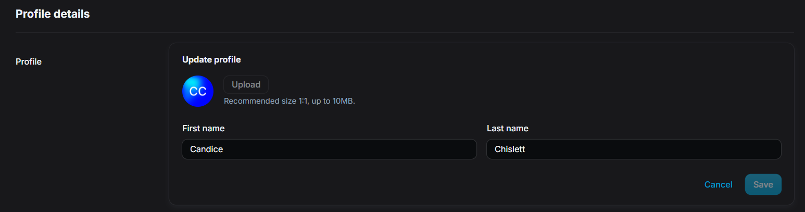
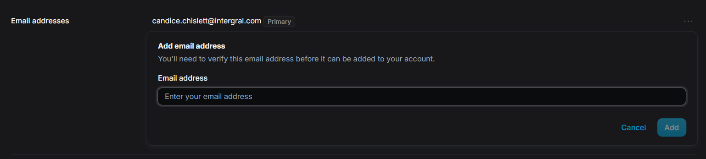

# User Profile

The **User Profile** page lets you manage your personal account settings and preferences, including your display name, email addresses, and connected accounts.

## Profile details

The **Profile details** section shows your current profile photo (or initials if no image has been uploaded) and your display name.

### Updating your profile

Click **Update profile** to open the edit panel where you can:

- Upload a new profile photo (must be square, 1:1 aspect ratio, max 10 MB)
- Update your first and last name

Click **Save** to apply changes, or **Cancel** to exit without saving.

## Email addresses

This section lists all email addresses linked to your account, with your primary address clearly labelled.

### Adding an email address

Click **+ Add email address**, enter the new address, then click **Add**. You will receive a verification email before the address is officially added to your account.

## Connected accounts

The **Connected accounts** section shows any third-party accounts linked to your profile (e.g. Google). These can be used for single sign-on (SSO) when logging in to OpsPilot.

---

!!! question "Need more help?"
    Contact support in the chat bubble and let us know how we can assist.
