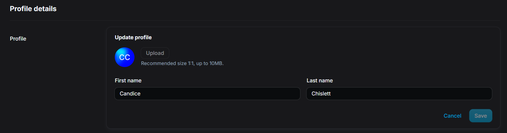

# Profile

This section lets you manage your personal profile settings, including your profile details, email addresses, and connected accounts.

## Accessing profile settings

!!! tip
    You can also quickly access your profile by clicking your name and avatar at the bottom left corner of the screen on the Account page.

## Profile details

In **Profile details**, you’ll see your profile photo (or initials if no image is uploaded) along with your display name. You’ll also find a list of the email addresses linked to your account. 

### Updating your Profile Settings

You can update your profile settings by clicking **Update profile** in the Profile section. This brings up a panel where you can change your profile photo, first name, and last name. To update your image, click the **Upload** button—make sure your file is a square (1:1 aspect ratio) and no larger than 10MB.

Below the image, you’ll find fields for your first and last name. Make any changes as needed, then click **Save** to apply them. If you change your mind, you can click **Cancel** to exit without saving.

### Updating your email address

To add another email address to your account, click the **+ Add email address** button. A field will appear where you can type in the new email you'd like to associate with your profile.

After entering the address, click **Add**. You’ll be asked to verify the new email before it’s officially added to your account. This ensures that the email belongs to you and can be used for login, notifications, or as a backup. If you change your mind, just click **Cancel** to exit without adding it.

