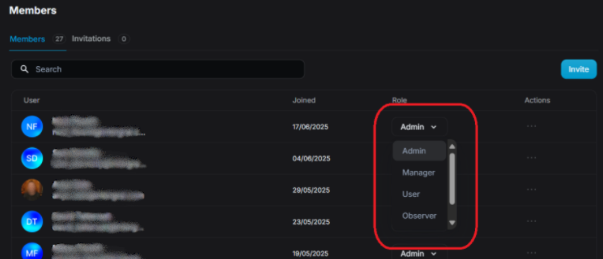

FusionReactor Cloud supports multiple member roles, each with different levels of access and responsibilities within the organization. Use this to scale or restrict access as your team evolves.

!!! note
    You must be an Admin to modify other users' roles.

| **Role**    | **Description** |
|-------------|-----------------|
| **Admin**   | Full access, including organization settings and member management. The **Admin** role can: <ul><li>Delete users from the account</li><li>Configure alerting services</li><li>Access account billing</li><li>Disable log ingest & OpsPilot for their organization</li></ul> |
| **Manager** | The **Manager** level allows for account management, having access to all of the features of the standard User type but with the added ability to: <ul><li>Manage configured applications</li><li>Manage configured servers</li><li>Disable log ingest & OpsPilot for their organization</li></ul> |
| **Observer**| The **Observer** account type is primarily a read-only user. This user type has access to all of the main functionality albeit with a read-only status. An observer has read and write access to their own data such as user information and quick links. |
| **User**    | A **User** is the typical user level. They have access to all the features of the software with both read and write permission. |
| **Business**| A **Business Contact** member is only able to view the on-premise billing and license keys for the Organization. |

### Removing members
To remove a user:

1. Click the ⋯ (Actions menu) next to their name.
2. Select **Remove member**.
3. Confirm the removal.

