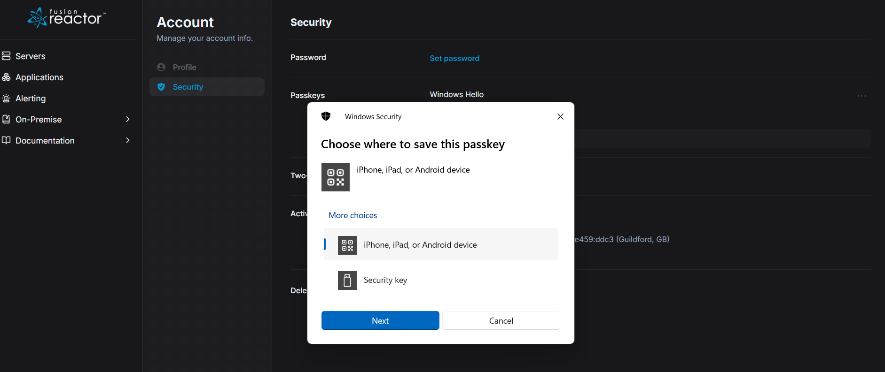

# Security

This dedicated Security page serves as your central hub for managing and enhancing the protection of your account. Here, you can actively control various aspects of your digital safety, including setting and updating your password, configuring secure passkeys for streamlined and robust authentication, and enabling two-step verification for an added layer of defense against unauthorized access. Additionally, you'll find a clear overview of your active devices, allowing you to monitor where your account is currently logged in. This comprehensive section empowers you to maintain strong control over your account's integrity and privacy.

## Password

This section allows you to change your account password.

### Changing your Password

To set a new password, you will find two fields: **New password** and **Confirm password**. Enter your desired new password into the "New password" field, and then re-enter the exact same password into the "Confirm password" field to ensure accuracy.

Below these fields, you'll see an option to **Sign out of all other devices**. It is highly recommended to check this box. Doing so will automatically sign out any other devices that may still be logged in with your old password, enhancing your account's security.

Once you have entered and confirmed your new password and made your selection for signing out of other devices, click **Save** to apply the changes. If you decide not to change your password or wish to discard your entries, simply click **Cancel** to return to the previous page without saving.

## Passkeys 

Passkeys provide a more convenient and secure way to sign in.

### Adding a Passkey

When you click **+ Add a passkey** from the Security page, a "Windows Security" pop-up window will appear, prompting you to "Choose where to save this passkey." This step allows you to select the method you prefer for storing your new passkey.

You have the following options:

* **iPhone, iPad, or Android device:** Select this option if you wish to save your passkey to a mobile device. This typically involves using your phone's built-in security features (like Face ID, Touch ID, or screen lock) to authenticate and store the passkey securely. You might be prompted to scan a QR code or approve a notification on your mobile device.
* **Security key:** Choose this option if you have a physical security key (like a YubiKey or similar FIDO-compliant device) and want to use it to store your passkey. This method offers strong, hardware-based security.

Once you have selected your preferred method:

* Click **Next** to proceed with the passkey creation process based on your chosen storage option. You will then follow further instructions to complete the setup.
* Click **Cancel** to close the window and abort the passkey addition process without saving any new passkey.

## Two-step verification

When you opt to add two-step verification, you'll be presented with the **+ two-step verification** prompt. This method enhances your account's security by requiring a second form of verification in addition to your password. To set this up, you'll need an authenticator app on your smartphone (such as Google Authenticator, Microsoft Authenticator, or Authy). 

The page displays a unique QR code that you must scan using your chosen authenticator application. Scanning this QR code will securely link the app to your account, generating time-sensitive codes that you'll use for future logins. If you are unable to scan the QR code, click the **Can't scan QR code?** link for alternative setup instructions, typically involving a manual key entry. 

Once the QR code is scanned and the app is linked, click **Continue** to finalize the setup, or **Cancel** to abort the process.