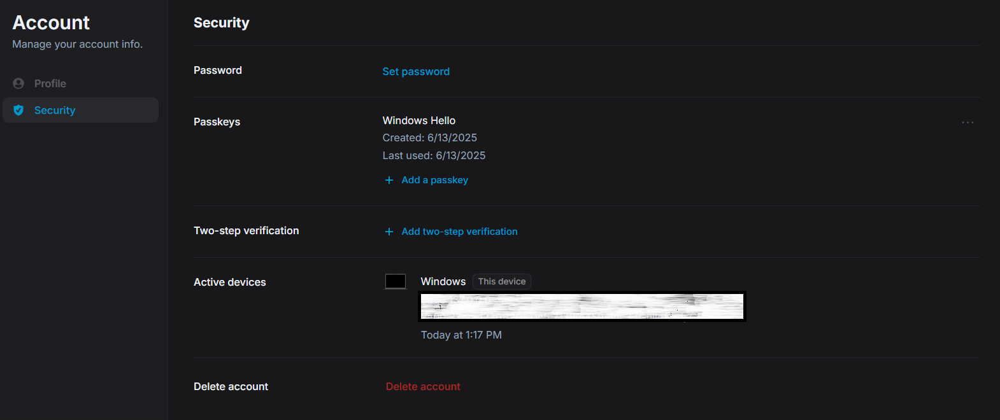
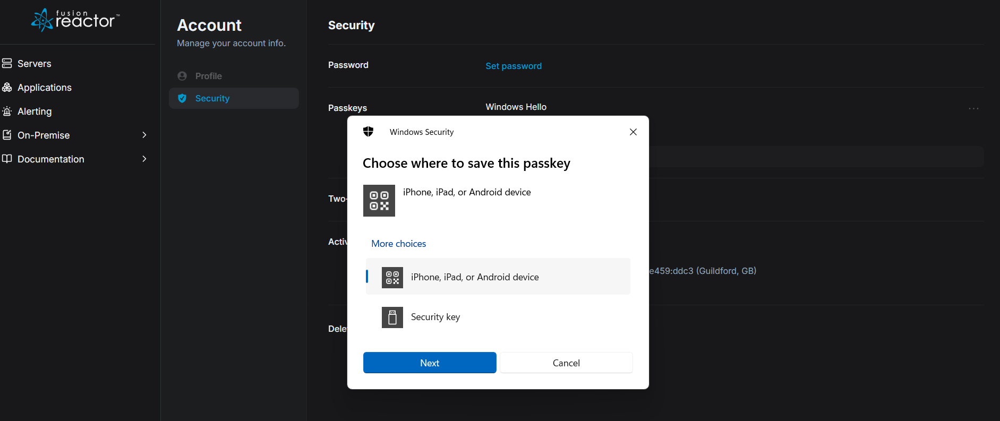

# User Security

The **User Security** page lets you manage the security settings for your account, including your password, passkeys, and two-step verification.

## Password

To set a new password:

1. Enter your new password in the **New password** field.
2. Re-enter it in the **Confirm password** field.
3. Check **Sign out of all other devices** to revoke access from any other active sessions.
4. Click **Save** to apply, or **Cancel** to discard.

## Passkeys

Passkeys provide a more convenient and secure way to sign in without a password.

### Adding a passkey

Click **+ Add a passkey**. You will be prompted to choose where to save it:

| Option | Description |
|---|---|
| **iPhone, iPad, or Android device** | Saves the passkey to your mobile device using Face ID, Touch ID, or screen lock |
| **Security key** | Saves the passkey to a physical FIDO-compliant hardware key (e.g. YubiKey) |

Click **Next** to complete setup, or **Cancel** to abort.

## Two-step verification

Two-step verification adds a second layer of security to your login by requiring a time-sensitive code from an authenticator app (e.g. Google Authenticator, Microsoft Authenticator, or Authy).

### Setting up two-step verification

1. Click **+ Two-step verification**.
2. Scan the QR code displayed on screen using your authenticator app.
3. If you cannot scan the QR code, click **Can't scan QR code?** to enter the key manually.
4. Click **Continue** to complete setup, or **Cancel** to abort.

---

!!! question "Need more help?"
    Contact support in the chat bubble and let us know how we can assist.
