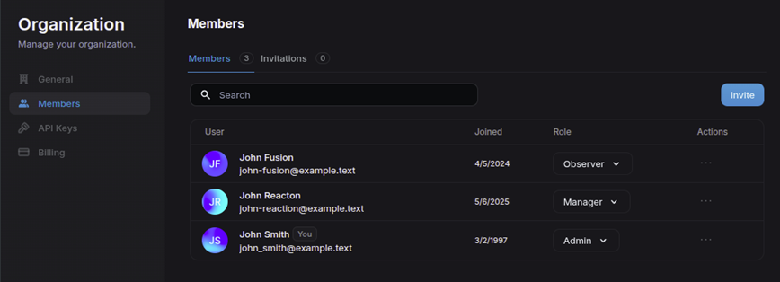

# Organization Users

The **Organization Users** page lets you view and manage all members of your organization, assign roles, and invite new users.

## Viewing members

Each row in the members list includes:

| Field | Description |
|---|---|
| **Name & Email** | Display name and primary email address |
| **Joined** | Date the user was added to the organization |
| **Role** | The current permission level assigned to the member |
| **Actions (...)** | Remove the member from the organization |

Use the search bar to filter members by name or email.

## Inviting members

Click **Invite** in the top right to add a new user:

1. Enter the email address of the invitee.
2. Assign a default role.
3. Click **Invite** to send the invitation.

!!! info
    Users are notified by email when invited to an organization.

## Role management

Use the **Role** dropdown to instantly change a member's permission level.

!!! info "Learn more"
    [Roles](/Admin-and-data/Account/Cloud/roles/)

---

!!! question "Need more help?"
    Contact support in the chat bubble and let us know how we can assist.
