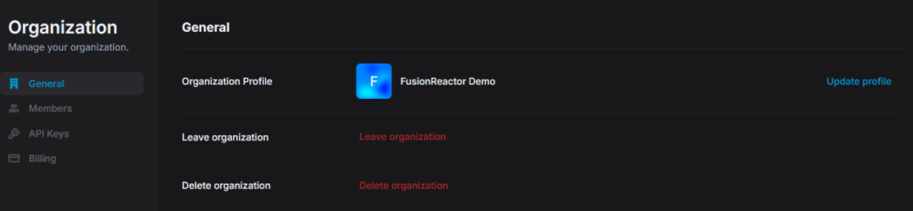

# Account & member management

## Organizational Settings

### General

This section covers the basic organization-level settings accessible under the **General** tab in FusionReactor Cloud.

#### Organization Profile

The Organization Profile section lets you view and update your organization's name and logo, which are shown to all members across the interface.

#### Leave Organization

The **Leave Organization** option lets any member (except the last admin) remove themselves from the org, which immediately revokes access to all org data and requires a new admin invitation to rejoin.

!!! note
    If you're the last admin in the organization, you **cannot leave** — you must either promote another member to admin or delete the organization instead.

#### Delete Organization

Only admins can delete the organization, which permanently removes all members, data, and settings — this action cannot be undone.

### Members

The **Members** tab in FusionReactor Cloud allows you to manage all users associated with your organization. You can view member details, assign roles, invite new members, and control access.

#### Viewing Members

Each row in the Members list includes:

* **Name & Email** – Display name and primary email address.
* **Joined** – Date the user was added to the organization.
* **Role** – The current permission level assigned to the member.
* **Actions** – (⋯) menu to remove a member.

You can also:

* Use the search bar to filter members by name or email.
* Navigate through multiple pages if your org has many users.

#### Inviting Members

Click the **Invite** button in the top-right to add new users:

1. Enter the email address of the invitee.
2. Assign a default role.

!!! info
    Users are notified by email when invited to an organization.

#### Role Management
Use the dropdown under Role to instantly change a member’s permission level.

!!! info "Learn more"
    [Roles](/Admin-and-data/Account/Cloud/roles.md)

    

