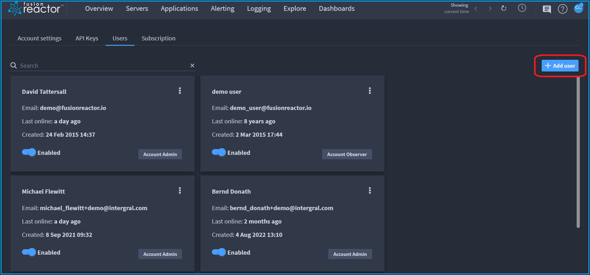
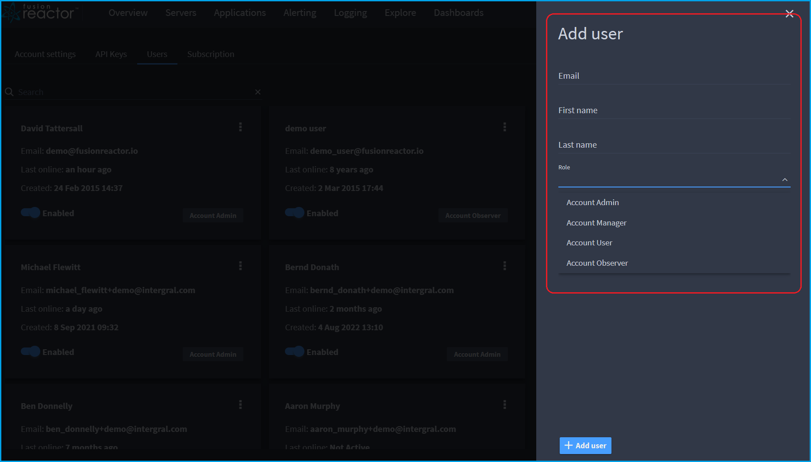
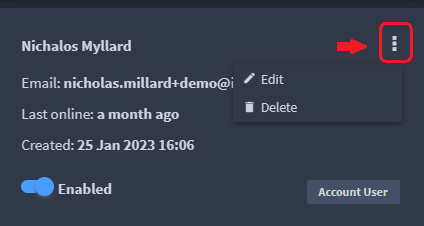
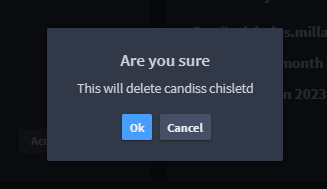

# Account & user management

## User types

🔎**Find it**: **FusionReactor** > **Account** > **Users** 

FusionReactor Cloud has five types of user:

* [Account Admin](/frdocs/Admin-and-data/Account/Cloud/users/#account-admin)
* [Account Manager](/frdocs/Admin-and-data/Account/Cloud/users/#account-manager)
* [Account User](/frdocs/Admin-and-data/Account/Cloud/users/#account-user)
* [Account Observer](/frdocs/Admin-and-data/Account/Cloud/users/#account-observer) 
* [Business Contact](/frdocs/Admin-and-data/Account/Cloud/users/#business-contact)

The account types have a hierarchical structure and each level above **Observer** inherits from the level below.

### Account Admin

The **Admin** account type is the most powerful user type and has access to all of the features of the cloud including the ability to close the account and control the billing settings. As well as all of the features of **Manager**, the **Admin** level also allows users to:

* Delete users from the account
* Configure alerting services
* Access account billing 

Typically, this user is seen as the account owner and billing contact and would be responsible for managing their FusionReactor Cloud account.  

### Account Manager

The **Manager** level allows for account management, having access to all of the features of the standard User type but with the added ability to:

* Add or update users on the account
* Manage configured applications
* Manage configured servers

### Account User

A **User** is the typical user level. They have access to all the features of the software with both read and write permission.

### Account Observer

The **Observer** account type is primarily a read only user. This user type has access to all of the main functionality albeit with a read only status. An observer has read and write access to their own data such as user information and quick links.

### Business Contact

A **Business Contact** account type is able to view the license keys for the account.

## Manage existing users

Administrators can create, edit, and remove users.

### Add new user

🔎**Find it**: **FusionReactor** > **Account** > **Users** > **Add user**

1) To add a user, select **Add user**.

  

2)  The following screen is displayed:

  

3)  Complete the input boxes for **Email**, **First name** and **Last name**.

4) Use the **Role** dropdown to select the account type.

5) When all details are completed, select **Add user** at the bottom of the screen.

### Edit existing users

1) To edit existing users, click on the three vertical dots to the right of the user name.

2) Select the **Edit** icon.

3) The **Update details** screen is displayed.

4) Make any changes and select **Save** at the bottom of the screen.

### Remove user

1) To delete a user, click on the three vertical dots to the right of the user name.

 

2) Select the **Delete** icon.

3) The following warning is displayed:

3) Select **Ok** to delete user.

___

!!! question "Need more help?"
    Contact support in the chat bubble and let us know how we can assist.