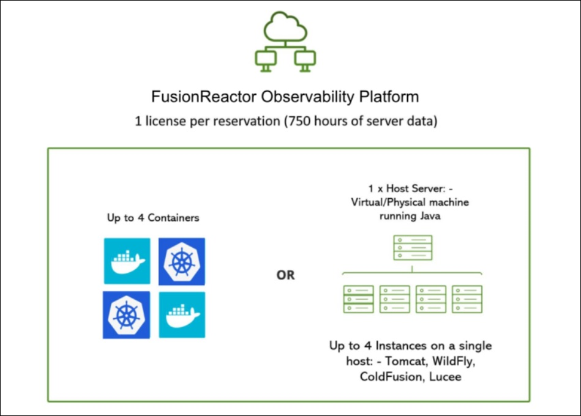

# Billing

**FusionReactor Cloud** capabilities are growing and expanding at a rapid rate. As a complete observability solution, our usage-based billing plan meets your needs in a diverging technical space and we pride ourselves on offering **essential** observability at **sensible** prices. 

To start your FusionReactor journey, first sign up for a free, no-obligation [trial](https://app.fusionreactor.io/auth/register). Once you’ve experienced the benefits, all purchase transactions can be easily managed within the app itself.

## What's included

|**Product**| **Price** | **Metrics** | **Logs** | **Traces** | **OpsPilot tokens**|
|------------ | ------------- | ------------ | ----------- | ------ |-----|
**Trial** | FREE | Unlimited |Unlimited| Unlimited| 1000 |
**Starter Plan** | $49 (A)   $59 (M) | 10,000 | 25 GB  | 25 GB  | 500 |
**Pro AI Plan** | $249 (A)   $299 (M) |20,000 |100 GB |  100 GB | 5,000 |
**Advanced AI Plan** | $899 (A)   $1,079 (M) |50,000 |250 GB |  250 GB |20,000 |
**FusionReactor Ultimate** | $79 (A)  $95 (M) | 5,000 | 2 GB  | 2 GB | 
**Historical data retention** |   | 13 months | 30 days|30 days |

!!! info
    Custom dashboards are available on all plans at no additional cost.

!!! note
    Additional [on-demand](/Admin-and-data/Billing/Cloud/overview/#on-demand-usage-costs) usage outside of the plan is chargeable.

## Plans

### Starter Plan

The **Starter Plan** is recommended for strict observability, distributed tracing, infrastructure monitoring and log management as it is simple and cost effective. It has a base cost of $49, which includes:

| **Metrics** | **Logs** | **Traces** | **OpsPilot tokens**| **Snapshots/Profiles** |
|:------------:| :-------------: | :------------:| :-----------: |  :-----------: | 
| 10,000 | 25 GB | 25 GB  |  500 | 5 GB|

In addition to this base cost, we also offer usage-based metered costs for OpsPilot tokens, logs, metrics, and traces, so you only pay for what you use beyond the included amount. 

!!! info "Learn  more"
    [On-demand usage costs](/Admin-and-data/Billing/Cloud/overview/#on-demand-usage-costs)

### Pro AI Plan

The **Pro AI Plan** is designed to provide a higher level of granularity and depth in monitoring and analyzing your system's performance. It allows for greater visibility into the various aspects of your application or infrastructure, enabling you to track and analyze a larger volume of logs, traces, and metrics. Additionally, the increased OpsPilot AI tokens allow you to ask questions about your applications or technology in plain English, as well as help you quickly identify issues and anomalies in your logs.

The **Pro AI Plan** has a base cost of $249 which includes:

| **Metrics** | **Logs** | **Traces** | **OpsPilot tokens**| **Snapshots/Profiles** |
|:------------:| :-------------: | :------------:| :-----------: |  :-----------: | 
| 20,000 |100 GB |  100 GB | 5,000 | 10 GB|

In addition to this base cost, we also offer usage-based metered costs for OpsPilot tokens, logs, metrics, and traces, so you only pay for what you use beyond the included amount. 

!!! info "Learn  more"
    [On-demand usage costs](/Admin-and-data/Billing/Cloud/overview/#on-demand-usage-costs)

### Advanced AI Plan

The **Advanced AI Plan** is our premium offering, designed to cater to those who require extensive resources and advanced features. 

The **Advanced AI Plan** has a base cost of $899, which includes:

| **Metrics** | **Logs** | **Traces** | **OpsPilot tokens**| **Snapshots/Profiles** |
|:------------:| :-------------: | :------------:| :-----------: |  :-----------: | 
|50,000 |250 GB |  250 GB |20,000 | 30 GB|

The **Advanced AI** plan also includes an audit of your OpsPilot queries. Additionally, you'll have access to our most powerful AI capabilities, allowing you to leverage cutting-edge technology to drive your operations forward. 

In addition to this base cost, we also offer usage-based metered costs for OpsPilot tokens, logs, metrics, and traces, so you only pay for what you use beyond the included amount. 

!!! info "Learn  more"
    [On-demand usage costs](/Admin-and-data/Billing/Cloud/overview/#on-demand-usage-costs)

    
### Custom pricing

Require a large number of [seats](/Admin-and-data/Billing/Cloud/overview/#fusionreactor-ultimate)? Why not get in touch with our Sales Team who will create a custom pricing plan to suit your requirements. 

## OpsPilot AI 

**OpsPilot AI** is an advanced observability solution that leverages generative AI to provide powerful insights into the performance of your applications. Using OpsPilot AI tokens enables you to identify and resolve issues before they occur, optimize the performance of your applications, and reduce downtime.

!!! info "Learn more"
    [OpsPilot](/Data-insights/Features/OpsPilot/AIoverview/)

!!! warning 
    As the OpsPilot AI uses previous prompts and responses to reply to a query, long involved responses can prove costly.

## FusionReactor Ultimate
To effectively manage costs, a customer can optionally reserve a **FusionReactor Ultimate** seat for $79 billed monthly with an annual commitment or $95 billed monthly with no commitment. Each seat gives the user 750 hours of FusionReactor usage and includes 2GB logs, 5000 metrics and 2GB traces to cover the average usage from FusionReactor. This acts as a buffer to prevent most existing customers from entering the usage-based billing.

!!! note
    Additional [on-demand](/Admin-and-data/Billing/Cloud/overview/#on-demand-usage-costs) usage outside of the plan is chargeable.

### What is a seat?

A seat refers to a single, unique virtual or physical host with up to four instances of Java/ColdFusion installed or up to four Docker containers.

!!! example
    To monitor five to eight instances on a host, you'll need two seats.

!!! note
    It is possible to be billed on-demand for all usage. There is no requirement to reserve a FusionReactor Ultimate seat.

## On-demand

FusionReactor Agent is also  billable fully on-demand. In these cases it will not include the logs, metrics and traces usage which will be billed in addition to the hourly cost of using an agent.  

!!! note 
    Customers will always have to purchase the **Starter** plan, which includes the set number of metrics, logs, traces, OpsPilot tokens and snapshots. 

### On-demand usage costs

FusionReactor, logs, metrics, and traces are all available at on-demand rates for those who go over the included allowance in the base cost and FusionReactor Ultimate.

FusionReactor instances will continue to be billed at $0.13 per hour, but their metrics, logos and traces will be charged additionally.

On-demand data will be charged at:

| **FR instance**| **Metrics** | **Logs** | **Traces** | **OpsPilot tokens**| **Snapshots/Profiles** |
|:------------:| :-------------: | :------------:| :-----------: |  :-----------: | :-----------: | 
|  $0.13 /hour|$10 /1K  | $0.5 /1 GB |  $0.5 /1 GB  |$20 for 250 | $0.5 /1 GB |

!!! info 
    [How to reduce costs in FR Cloud](/Troubleshooting/Optimize-data/)
    

## Usage calculations

Both annual and monthly plan usage is calculated and billed each month. 

|Data type|Description |
|--- |--- |
|**FR hours**|Calculated by performing a **sum** of all values over the billing period. |
|**Metrics**|Calculated by performing a **mean average** for the billing period|
|**Logs**|Calculated by performing a **sum** of all values over the billing period.|
|**Traces**|Calculated by performing a **sum** of all values over the billing period.|
|**OpsPilot tokens**|Calculated by performing a **sum** of all values over the billing period.|

## Usage dashboards

To help keep things simple and transparent, **FusionReactor** has developed usage dashboards that allow you to visually track your billing data. You can also create alerts to fire if you exceed the allowed usage. These dashboards are located in **Billing Dashboards** where you can access **Data Usage** to calculate your approximate usage and the **Billing Usage** dashboard for a breakdown of your bill.

### Data usage

The data usage dashboard calculates the approximate usage of the FR instance, metrics, logs and traces. It displays the raw values or unedited data you have sent to FusionReactor. 

#### FusionReactor instance

The first total in the graph relates to the FusionReactor instances and provides the number of hours the instance has been used. 

For example, in the above graphic, the total number of hours in the FR instance is 3235 hours over 30 days which equates to running 5 seats. The figure of 306 hours shows the hours spent in the instance for the last 24 hours.

#### Metrics

In the **Metrics** section of the dashboard you can view the maximum number of metric series over the 30 day period.  

For example, the above graphic indicates that 70143 series of metrics have been received over the 30 day period. The figure below of 47539 series shows the number of metrics received in the last 24 hours.

!!! note
    For billing purposes, your account will never be at zero. We will add some metrics to your account in order to measure account usage.

#### Logs 

In the **Logs** section of the dashboard you can view the  total number of logs that have been ingested over the 30 day period. 

For example, the above graphic indicates that 26 GB of logs have been ingested over the 30 day period. The figure below of 948MB  shows the number of logs ingested in the last 24 hours.

#### Traces

In the **Traces** section of the dashboard you can view the  total number of traces that have been ingested over the 30 day period. 

For example, the above graphic indicates that 733 GB of traces have been ingested over the 30 day period. The figure below that of 21.4GB shows the number of traces ingested in the last 24 hours.

#### Data usage metrics

These are the current metrics FusionReactor supports for billing. 

**fr_usage_minutes**: The amount of time used by running FR instances (per minute).

**fr_logs_bytes_received**: The amount of logs ingested into your account (per hour).

**fr_traces_bytes_received**: The amount of traces ingested into your account (per hour). 

**fr_metrics_series_count**: The number of metric series ingested into your account (per hour).

### Billing usage 

At **FusionReactor** we have created the **Billing usage** dashboard to ensure cost transparency. This dashboard displays a breakdown of your billing usage into clearly defined sections to help you keep on top of your spending. 

The dashboard provides the following:

* Plan cost

* Seat cost

* Additional Usage cost

* Total cost

To the right of the costs overview is a pie chart which visually displays your costs according to:

* Plan

* Seats

* Agents

* Metrics

* Logs

* Traces

The dashboard also provides detailed breakdowns for metrics, logs, traces and the FR agent of the following: 

* Current Usage

* Additional Usage

* Additional Charge Cost

Alongside each data source is a graph that provides further information on your usage as three different categories: Additional (green), Included (yellow), and Billed Total (blue). Any usage above the yellow line on the graph will be billed at on-demand rates.

#### Create an alert

To control your usage and spending costs it is possible to create an alert to fire if you exceed the allowed usage. 

!!! info "Learn more"
    [Create a check](/Data-insights/Features/alerting/#create-a-check)

#### Example billing usage checks

For instructions on configuring billing checks, see the [Billing usage checks](/Data-insights/Features/billing-check) section. The following are examples of common billing usage checks: 

* `fr_billing_usage_current`
* `fr_billing_charges_metered`
* `fr_billing_usage`
* `fr_billing_charges_total`

## Modifications

It is important to note that any upgrades you make to your billing plan occur immediately while downgrades will only come into effect at the end of the billing period. 

___

!!! question "Need more help?"
    Contact support in the chat bubble and let us know how we can assist.
