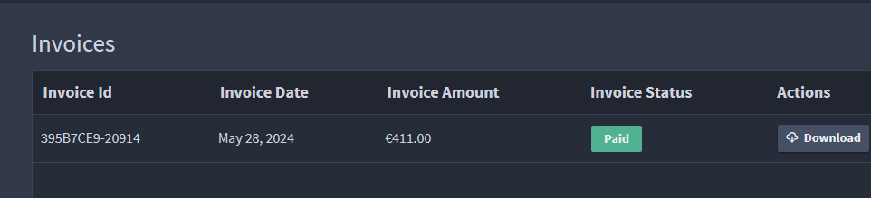

FusionReactor is available in 2 editions with or without Cloud features:

* [FusionReactor Ultimate](/Admin-and-data/Billing/On-Premise/billing/#fusionreactor-ultimate)

* [FusionReactor Developer](/Admin-and-data/Billing/On-Premise/billing/#fusionreactor-developer)

|**Edition**| **Annual** | **Monthly** | 
|------------ | ------------- | ------------ | 
| Ultimate | $79 | $95 |
| Developer | $19 | $22 |

Each edition utilizes the same powerful agent, ensuring a consistent and efficient monitoring experience across all environments. You can purchase as many Ultimate/Developer seats you need and assign them to a license.

Both editions are available as an **annual** or **monthly** subscription, which means that you’re entitled to all updates and upgrades of the product as long as you have an active subscription.

## FusionReactor Ultimate

Ultimate on-premise edition is for production environments, and includes all features for comprehensive application performance monitoring.

|**Edition**| **Annual** | **Monthly** | 
|------------ | ------------- | ------------ | 
| Ultimate | $79 | $95 |

## FusionReactor Developer

Developer on-premise edition has the same features as Ultimate, but should be exclusively used in DEV and/or non customer facing QA environments.

|**Edition**| **Annual** | **Monthly** | 
|------------ | ------------- | ------------ | 
| Developer | $19 | $22 |

## What is a seat? 

A seat is a single unique virtual or physical host with up to four instances of Java / ColdFusion installed. 

!!! example
    To monitor five to eight instances on a host, you'll need two seats.

!!! note
    These licenses do not send monitoring data up to the cloud

### How do I purchase a seat(s)?

Seats can be bought in the purchase page of the product as follows:

**Step 1**: Select number of seats

Enter the number of seats you require and select **Confirm**.

!!! info 
    Subscriptions can be annual or monthly but both are billed monthly. 

**Step 2**: Pay with card

Add your card information, cardholder details and billing address in the text boxes and select **Pay and subscribe**.

**Step 3**: View your subscriptions

Once a purchase is made, you can view your subscriptions under the **Billing** tab.

## Manage subscriptions

Once purchased, you can easily manage your subscriptions in the following ways:

* Add or remove seats

* Change renewal interval

* Cancel subscription

!!! note
    Upgrades you make to your billing plan occur immediately while downgrades only come into effect at the end of the billing period. 

## Invoices

The **Invoice** box contains the following following information regarding your invoices:

* Invoice ID

* Invoice Date

* Invoice Amount

* Invoice status

!!! note
    Cloud invoices are also displayed in this table if applicable.  

!!! info 
    Your invoices can be downloaded by selecting the **download** button under Actions.

## Edit payment details

From the **Billing** page it is also possible to update your billing details by selecting **Change Details** in the Billing Details box where you can edit your details in Stripe. 

## Modifications

It is important to note that any upgrades you make to your billing plan occur immediately while downgrades will only come into effect at the end of the billing period. Users can only upgrade or downgrade, not both simultaneously. 

!!! info
    Changing to monthly billing is considered a downgrade.

