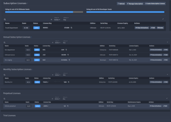
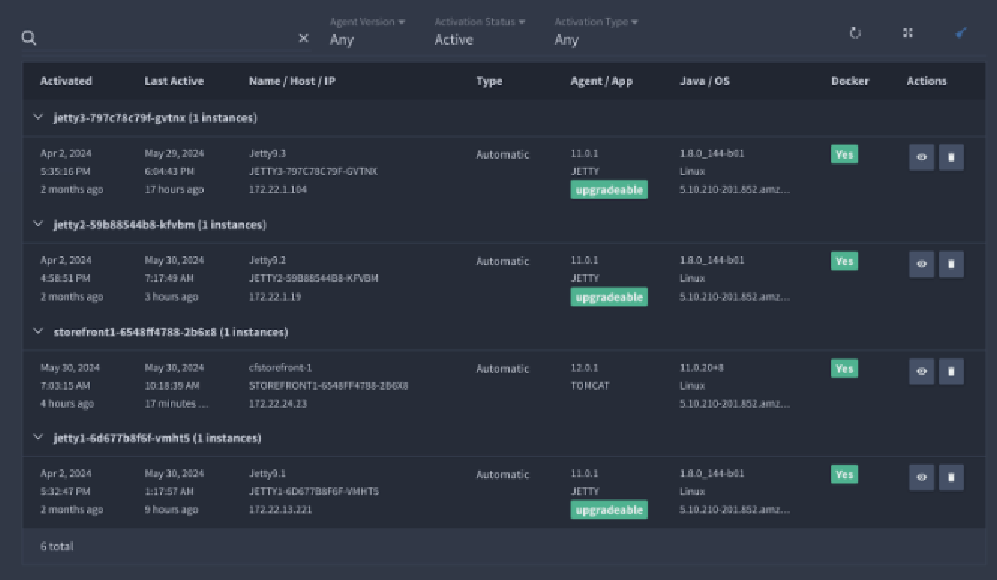
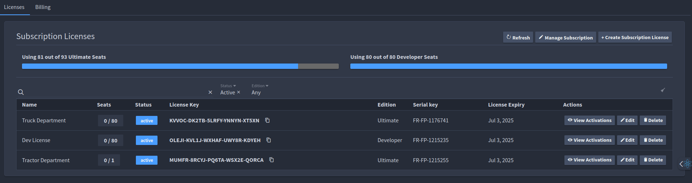
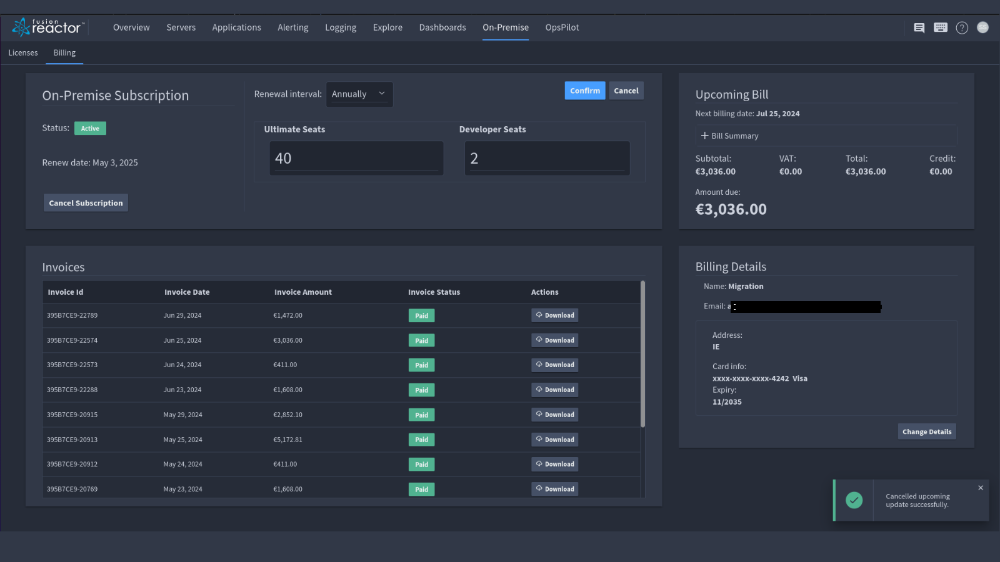
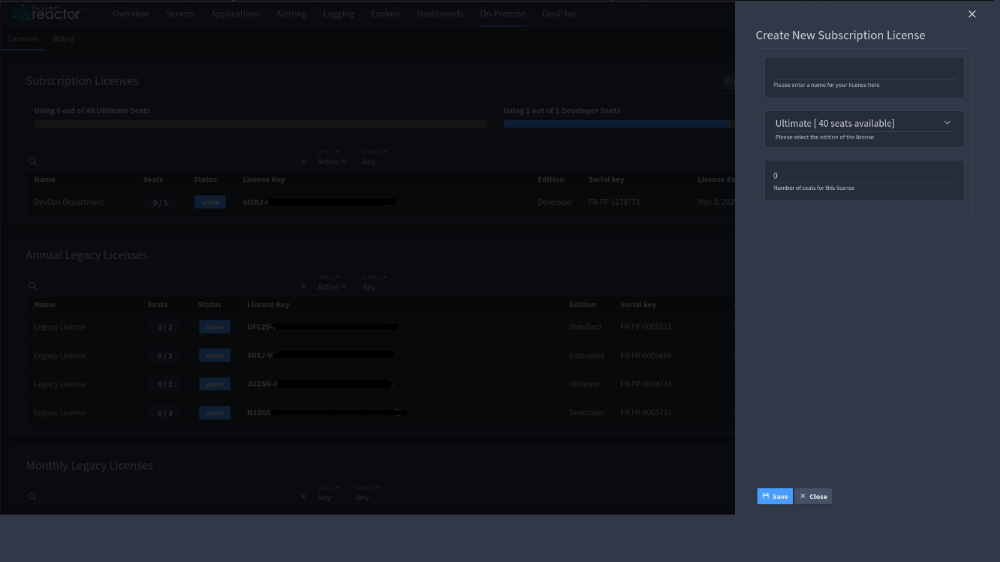

# Licenses

There are five types of license available in FusionReactor:

|**Type**| **Description** | 
|------------ | ------------- | 
| Subscription Licenses | Licenses billed through Stripe. |
| Annual Subscription Licenses  |Licenses billed manually or through Share IT.|
| Monthly Subscription Licenses  | Licenses billed manually or through Share IT.|
| Perpetual Licenses | Maintenance licenses. |
| Trial Licenses | A trial license that expires after 14 days. |

The **Licenses** page displays a list of all your license keys and you can view the following information:

|**Title**| **Description** | 
|------------ | ------------- | 
| Name | Name of the license. |
Seats |This is the number of seats used out of what has  been allocated to the license. |
|Status |This displays whether  the subscription is active or inactive.|
|License Key | The license key that is applied to the instance.|
| Edition  |The type of license that has been applied e.g Ultimate or Developer.|
| Serial Key  | The serial number for the license.|
| License Expiry | This is the subscription renewal date. Once it expires and after the grace period you won't be able to use the FR Agent at all on any version. |
|Actions | This allows you to view your activations and edit license details. |

## View activation history
Selecting the **View activation** button displays a list of the instances using a license key.

## Edit license details

Selecting  the **Edit**  button allows you to alter the license name and adjust how many seats are allocated to the license. 

## Manage subscriptions

The Manage Subscription button is a shortcut that takes you to the edit section of the billing information page. 

!!! note
    Any upgrades you make to your billing plan occur immediately while downgrades only come into effect at the end of the billing period. 
    
!!! info
    Users can only upgrade or downgrade, not both simultaneously. 

!!! info
    Changing to monthly billing is considered a downgrade.

## Create subscription license

1. Select **Create Subscription License**
2. Enter license details:
     -    Custom name for identification.
     -    Edition level.
     -    Number of required seats.

