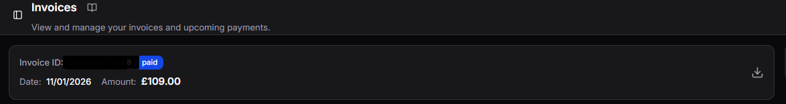

# Invoices

The **Invoices** page lets you view and manage your invoices and upcoming payments.

Each invoice displays the following information:

| Field | Description |
|---|---|
| **Invoice ID** | A unique identifier for the invoice |
| **Status** | Payment status (e.g. paid, pending) |
| **Date** | The date the invoice was issued |
| **Amount** | The total amount charged |

Click the download icon on the right of any invoice to download it as a PDF.

---

!!! question "Need more help?"
    Contact support in the chat bubble and let us know how we can assist.
