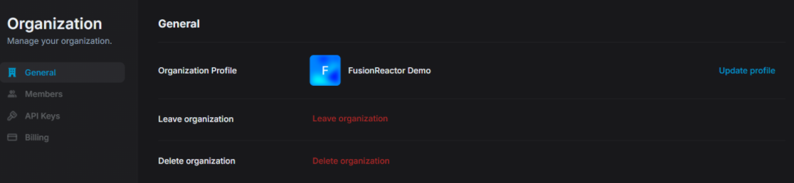

# Organization Settings

The **Organization Settings** page lets you manage your organization's profile and general configuration in OpsPilot.

## Organization Profile

The Organization Profile section lets you view and update your organization's name and logo, which are shown to all members across the interface.

## Leave organization

The **Leave organization** option lets any member (except the last admin) remove themselves from the organization. This immediately revokes access to all org data and requires a new admin invitation to rejoin.

!!! note
    If you are the last admin in the organization, you **cannot leave** - you must either promote another member to admin or delete the organization instead.

## Delete organization

Only admins can delete the organization. This permanently removes all members, data, and settings and cannot be undone.

---

!!! question "Need more help?"
    Contact support in the chat bubble and let us know how we can assist.
