# Servers

The Servers Overview, accessible under the **Explore** tab, provides a visual and intuitive representation of all monitored servers across various environments. This dashboard is designed to enable quick identification of performance issues, health states, and environment status at a glance.

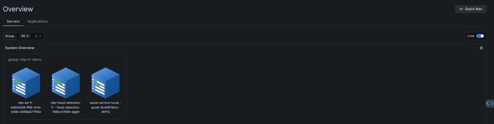

## Key features

- **Quick status check**: Visually assess the health and performance of your server fleet without needing to drill down into individual metrics.

- **Environment segregation**: Servers are grouped by environment (e.g.,`canary`, `stg_staging`, `prod`), allowing for easy filtering and environment-specific health checks.

- **Immediate issue identification**: Color-coding and visual states quickly draw attention to servers or groups experiencing issues.

### Component breakdown

This table describes the key elements you'll see on the **Overview** dashboard.

| **Component** | **Description** |
|----------------|-----------------|
| **Filter Bar (Group, All)** | Use this bar to filter the displayed server cubes based on server groups. |
| **System Overview** | The main area where all monitored servers or server groups are displayed as 3D cube icons. |
| **Server Cube Icon** | Each cube represents an individual server or a cluster/group of servers (e.g., `group: canary`). |
| **Cube Labeling** | Provides the Group/Environment name (top line) and the **instance name** on the bottom line for clear identification. |
| **Live Toggle** | Indicates if the view is displaying real-time data updates. |
| **Quick Nav** | A dropdown menu that provides immediate, centralized access to the main areas of the platform from any screen. |

## Visual indicators

The visual elements attached to each cube are the most critical tools for rapid assessment.

### Color codes (Health status)

The main color of the server cube or an indicator light changes to signal overall health or alert level.

| **Color** | **Indication** | **Notes** |
|------------|----------------|------------|
| 🟦 **Blue** | Healthy / Optimal | All key metrics are within normal operating thresholds. |
| 🟧 **Orange** | Warning / Elevated Risk | One or more metrics (e.g., CPU, Memory) are approaching their critical threshold. Action may be required. |
| 🟥 **Red** | Critical / Alert | One or more key metrics have exceeded the critical threshold, potentially impacting service availability or performance. Immediate action is required. |

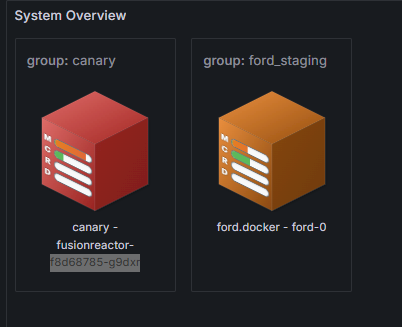

### Metric bars (M, C, R, D)

Small indicator bars displayed on the cube provide instantaneous utilization and performance data. The color intensity or fill level of each bar shows the current load or alert status for that specific metric.

| **Metric bar** | **Meaning** | **What it Measures** |
|-----------------|-----------------------------------------------|----------------------|
| **M** | **Memory** Usage | Current usage of heap and non-heap memory. |
| **C** | **CPU** Load | Current processor utilization. |
| **R** | Web **Request** count | The rate of incoming requests or the average time taken to process a request. |
| **D** | App **Database** Throughput Count | Monitors the number of database operations/queries handled by the application per unit time.

## Quick Nav

The Quick Nav is a dropdown menu providing immediate, centralized access to the most frequently used views - **Home, Overview, Applications, Servers, and Configuration**.

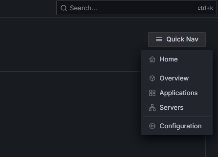

## Server Details

When you click on a Server cube from the System Overview dashboard, you'll be taken to a detailed management and monitoring view for that specific instance.

This detailed view is organized into top-level tabs that provide comprehensive diagnostics and monitoring capabilities:

- **UI Tunnel** - Access your on-premises application's user interface directly through FusionReactor Cloud.

- **Metrics** - Performance metrics and resource utilization data.

- **Traces** - Deep-dive request tracing for diagnostics.

- **Logs** - Application and system log analysis.

- **Info** - Client and server configuration information.

Each tab provides specialized tools for monitoring and troubleshooting your FusionReactor agent instance.

## UI Tunnel

The **UI Tunnel** in FusionReactor is a specialized feature that enables secure remote access to the detailed, local user interface (UI) of an on-premises FusionReactor Agent through the FusionReactor Cloud platform.

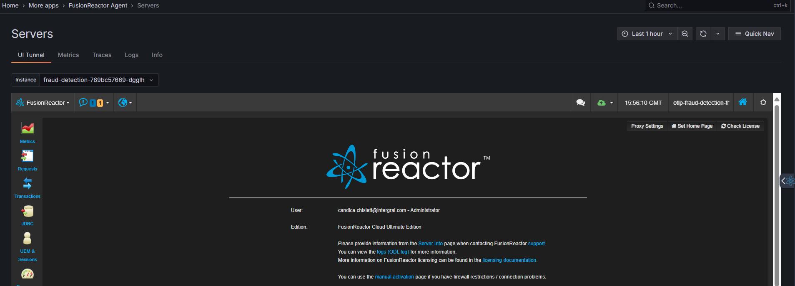

### Changing the UI theme (Dark/Light Mode)

The **UI Tunnel** defaults to dark mode for optimal viewing during extended monitoring sessions. You can easily switch between dark and light themes using the theme toggle (sun or moon) in the header bar.

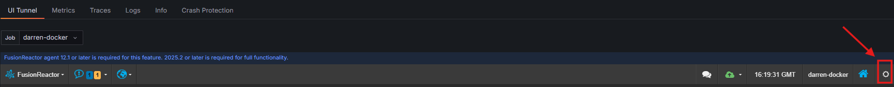

## Metrics

The **Metrics** tab provides an historic view of your server’s performance and health. Data updates automatically if an auto-refresh interval is set, or manually when a new time range is selected.

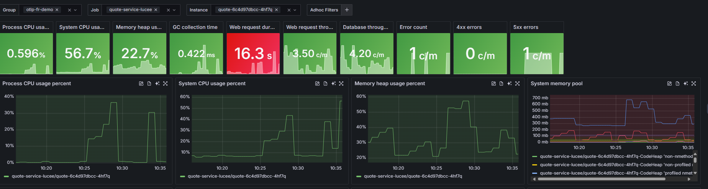

The boxes at the top display the latest collected performance metrics for the selected instance, based on the selected time range.

| **Metric**                         | **Description**                                           | **Why It’s Useful**                                            |
| ---------------------------------- | --------------------------------------------------------- | -------------------------------------------------------------- |
| **Process CPU Usage**              | Percentage of CPU used by this specific process.          | Detects CPU-intensive applications or bottlenecks.             |
| **System CPU Usage**               | Overall CPU usage across the system.                      | Helps identify if the host system is under load.               |
| **Memory Heap Usage**              | Amount of heap memory currently in use.                   | Useful for monitoring memory leaks or high memory consumption. |
| **GC Collection Time**             | Time spent performing garbage collection.                 | High values may indicate inefficient memory management.        |
| **Web Request Duration**           | Average time to complete a web request.                   | Reveals latency or slow response trends.                       |
| **Web Request Throughput**         | Number of requests handled per minute.                    | Shows traffic volume and server load.                          |
| **Database Throughput**            | Number of database operations per minute.                 | Helps track query load and database responsiveness.            |
| **Error Count / 4xx / 5xx Errors** | Number of failed or client/server-side errors per minute. | Quickly highlights failing transactions or service issues.     |

!!! note
    Panels refresh automatically if an auto-refresh interval is set using the top icon. Otherwise, they update when a new time range is selected.

### Detailed graphs

Each graph provides **historical trends** for the metrics shown below.

You can:

* **Zoom in or out** on a time range to analyze spikes or anomalies.
* **Hover over data points** to see exact metric values.
* **Compare multiple metrics** to find correlations (e.g., CPU spikes vs. increased error count).

Graphs include:

* CPU and Memory trends
* Garbage Collection behavior
* Request and error rates
* Database and trace throughput

This helps with **root-cause analysis** — understanding what led to a performance change or incident.

### Metric graph actions

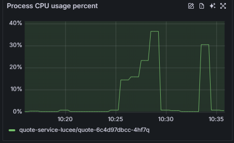

The top-right corner of each metric graph contains action icons that may vary depending on the dashboard and metric type:

1. **Edit Threshold** - Configure alert thresholds for this metric to receive notifications when values exceed defined limits (available on select dashboards).

2. **View Logs** - Access related log entries for the time period and service shown in the graph to investigate issues.

3. **Ask OpsPilot** - Send this metric to OpsPilot AI for natural language explanations and analysis of patterns or anomalies.

4. **Expand Graph** - Open the metric in full-screen view for detailed analysis and extended time ranges.

These actions provide quick access to troubleshooting and monitoring capabilities directly from the metric visualization. Note that not all actions are available for every metric or dashboard type.

### Threshold Configuration 

The **Configuration** page allows you to set and manage warning and critical thresholds for key performance metrics across your application. Thresholds help you identify performance degradation early — when a metric exceeds a configured limit, it triggers visual alerts in dashboards and monitoring panels.

You can adjust thresholds individually on certain graphs using the icon in the top right, or view and edit all thresholds in one place via **Quick Nav** → **Configuration**. 

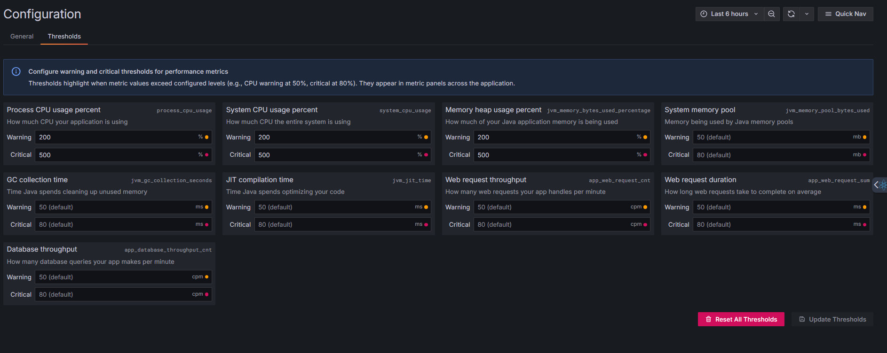

#### Setting threshold values

The **Edit Threshold** dialog allows you to configure two levels:

- **Warning** - Set a threshold for early notification of potential issues (e.g., CPU at 50%)
- **Critical** - Set a threshold for urgent alerts requiring immediate attention (e.g., CPU at 80%)

Enter numeric values appropriate for the metric type. Percentage-based metrics use values from 0-100, while other metrics accept values based on their unit of measurement.

Once configured, thresholds appear as visual indicators in metric panels across the application. When a metric value exceeds:

- The **Warning** threshold - displayed with a yellow/orange indicator.
- The **Critical** threshold - displayed with a red indicator.

This visual feedback helps you quickly identify performance issues across your monitored services.

Click **Update Thresholds** to apply your configuration. The new thresholds take effect immediately and will be used for all future metric evaluations.

### Filters & Controls

At the top of the screen, you can:

* **Select Group, Node, Job, Instance** – to view data for specific servers or services. You can select multiple servers to compare metrics across your infrastructure.
* **Set Time Range** – focus on the last hour, day, or a custom range.
* **Add Adhoc Filters** – isolate data for specific endpoints, users, or environments.

These dynamic filters make it easy to **narrow down the view** when diagnosing an issue. **Filters persist across tabs**, so when you switch between different dashboard views, your selected filters remain applied for consistent analysis.

## Traces

The **Traces** tab provides deep insights into the performance of individual requests (spans) as they move through the system. This view is critical for identifying slow transactions, latency issues, and service dependencies.

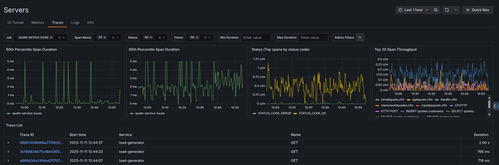

Four key graphs display at the top of the view:

1. **50th Percentile Span Duration** - Shows the median response time for requests, indicating typical performance.
2. **95th Percentile Span Duration** - Displays response times for 95% of requests, helping identify slower outliers.
3. **Status (Top spans by status code)** - Breaks down request volume by HTTP status codes (errors vs. successful requests).
4. **Top 20 Span Throughput** - Shows request volume for the most active endpoints or operations.

Use the filter bar to narrow down traces by:

- **Job** - The service or application name (e.g., quote-service-lucee).
- **Span Name** - Specific operation or endpoint.
- **Status** - HTTP status code (All, error, ok, unset).
- **Flavor** - Request type or protocol.
- **Min/Max Duration** - Filter by response time range.
- **Adhoc Filters** - Add custom filters with the + button.

Below the metrics, the trace list shows individual requests with:

- **Trace ID** - Unique identifier for the request (click to view detailed trace timeline).
- **Start time** - When the request began.
- **Service** - Which service handled the request.
- **Name** - The HTTP method (GET, POST, etc.).
- **Duration** - Total request processing time in milliseconds.

### Trace Details

When you click on a specific Trace ID from the Traces list, you navigate to the **Trace Details** view. This view is the core of distributed tracing, presenting the entire transaction flow as a precise waterfall diagram.

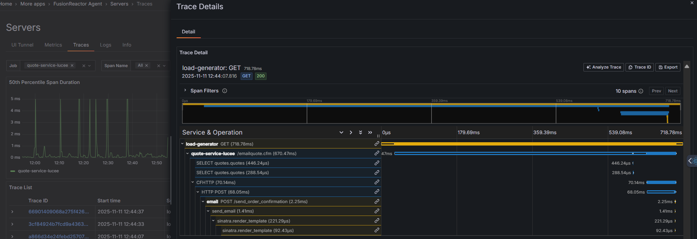

The header displays key information about the selected trace:

- **Service and Method** - The originating service and HTTP method (e.g., load-generator: POST).
- **Total Duration** - End-to-end request time (e.g., 513.22ms).
- **Timestamp** - Exact date and time the request started.
- **Status Code** - HTTP response code with visual badge (e.g., 200, POST).
- **Endpoint Path** - The API endpoint or route accessed.

#### Navigation Tabs

The trace details interface includes multiple tabs:

- **Detail** - The default view showing the waterfall diagram of the trace spans.
- **Profile** - When available, this tab displays a hierarchical flame graph showing method execution times and call stacks. Each entry shows the percentage of total execution time and duration (e.g., "100% - 1.61s") along with the full method path, allowing you to identify performance hotspots at the code level.
    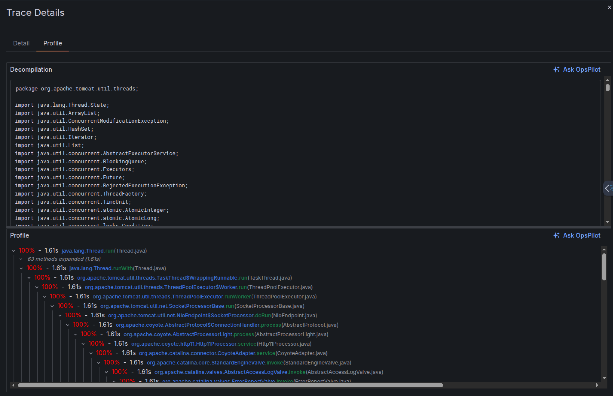

- **[Event Snapshot](https://docs.fusionreactor.io/Data-insights/Features/Debugger/Event-Snapshot/)** - This tab appears when a snapshot is associated with the trace, providing deep diagnostics including decompilation, frames, and request/response details captured at the point of the event.
     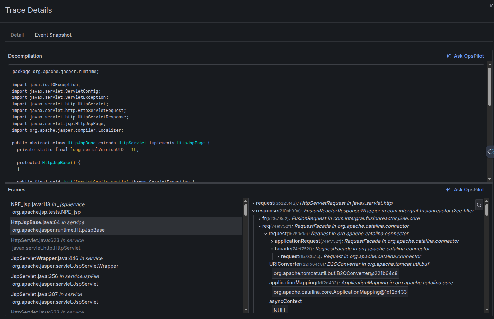

#### Trace Actions

Three action buttons in the top-right allow you to:

1. **Analyze Trace** - Send the trace to OpsPilot AI for natural language analysis of performance bottlenecks, errors, and optimization recommendations.

2. **Trace ID** - Copy the unique trace identifier to your clipboard for sharing or external analysis.

3. **Export** - Download the trace data in a portable format for offline analysis or archival.

## Logs

The **Logs** tab allows you to view, filter, and analyze the log messages generated by the specific server instance in real time. This is essential for debugging errors and understanding system events.

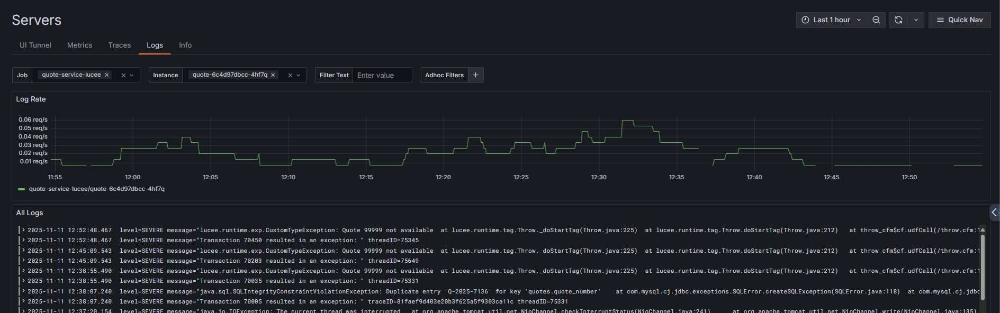

### Log Rate graph

The top graph displays the volume of log entries over time, measured in requests per second (req/s). This visualization helps you:

- Identify spikes in logging activity that may indicate issues.
- Correlate log volume with performance problems or errors.
- Understand normal logging patterns for your services.

#### Filtering logs

Use the filter bar to narrow down log entries:

- **Job** - Filter by service or application name (e.g., quote-service-lucee).
- **Instance** - Select a specific container or server instance (e.g., quote-6c4d97dbcc-4hf7q).
- **Filter Text** - Search for specific keywords, error messages, or patterns within log content.
- **Adhoc Filters** - Add custom filters with the + button to refine results further.

Filters work together to help you quickly locate relevant log entries in high-volume environments.

### Log stream

The **All Logs** section displays individual log entries in chronological order. Each entry shows:

- **Timestamp** - Exact date and time the log was generated (YYYY-MM-DD HH:MM:SS.mmm format).
- **Level** - Log severity (e.g., SEVERE, WARNING, INFO, DEBUG).
- **Message** - The complete log message, including stack traces for errors.

### Log details

When you click the arrow next to a log entry, it expands to show three sections:

- **Log Line** - The complete, raw log message exactly as written by the application. This includes the timestamp, severity level (e.g., SEVERE), and the full message text with any error details or stack traces.

- **Fields** - Structured metadata about the log entry, including the application name, service, instance ID, source file, and environment. Each field has icons that let you toggle visibility, view statistics, or add it as a filter.

- **Links** - Quick actions to explore related data:
    - **Trace** button - Opens the associated distributed trace to see the full request flow that generated this log
    - **Ask OpsPilot AI** button - Sends the log to OpsPilot for AI-powered analysis, explanations, and troubleshooting recommendations

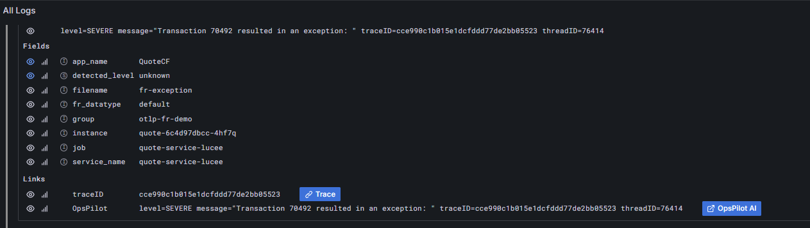

## Info 

The **Client Information** panel provides detailed configuration and environment data for the selected instance. Click any category to expand and view specific details.

- **OS** - Operating system details including name, version, and architecture
- **Server** - Application server information such as type, version, and configuration
- **ENV Vars** - Environment variables configured for the instance
- **Client** - Client-specific settings and identifiers
- **System** - System-level properties and resource information
- **JVM** - Java Virtual Machine details including version, memory settings, and runtime parameters
- **Product** - Product or application version information
- **Network** - Network configuration including hostnames, ports, and IP addresses
- **Docker** - Container-specific information such as image name, container ID, and orchestration details

### Usage

Select an instance from the dropdown at the top to view its configuration. Expand any category to see the detailed key-value pairs for that aspect of the instance. This information is useful for troubleshooting configuration issues, verifying deployment settings, or understanding the runtime environment.

