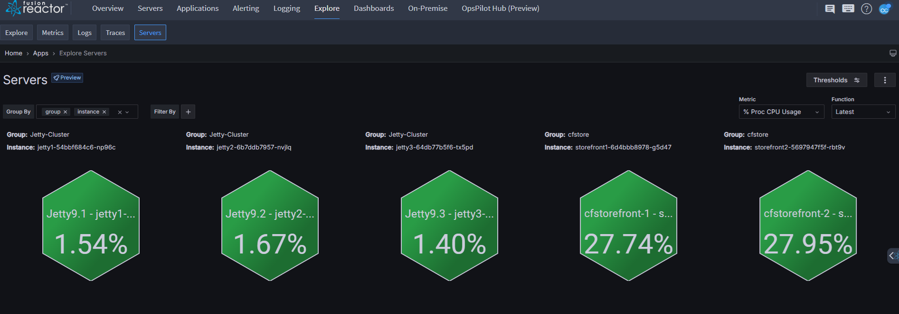
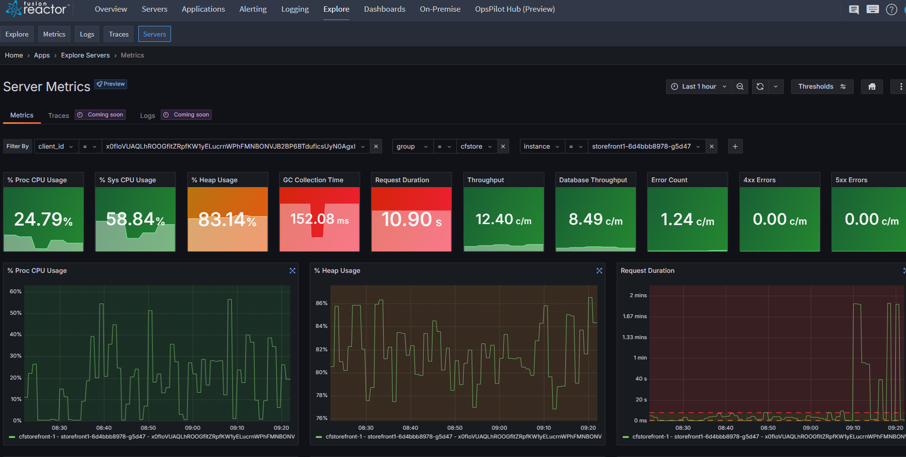
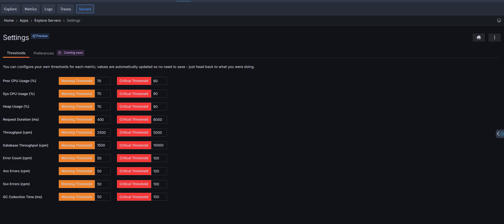

# Servers

## Overview

FusionReactor Cloud introduces Server Scenes, a powerful new feature providing a high-level view of your infrastructure and services. This documentation explains how to use and get the most out of the Explore: Servers functionality.

!!! note
    Explore: Servers is currently in preview. While fully functional, the feature is under active development and may receive updates and improvements based on user feedback.

<iframe src="https://player.vimeo.com/video/1024394849?title=0&amp;byline=0&amp;portrait=0&amp;badge=0&amp;autopause=0&amp;player_id=0&amp;app_id=58479" width="640" height="363" frameborder="0" allow="autoplay; fullscreen; picture-in-picture; clipboard-write" title="Explore Server Scenes"></iframe>

## Accessing Server Scenes

1. Navigate to the FusionReactor Cloud dashboard.
2. Click the **Explore** tab in the top navigation bar.
3. Select the **Servers** button.

## Key Features

- **Visual Health Dashboard**: Hexagonal tiles represent each server, displaying key metrics with color-coding for instant health assessment.
- **Grouping Capabilities**: Servers can be organized into logical groups (e.g. Jetty-Cluster).
- **Flexible Filtering**: Robust filtering options to focus on specific server sets.
- **Customizable Metrics**: Choose which metrics to display (e.g. % Sys CPU Usage).
- **Dynamic Updates**: Real-time metric updates for continuous monitoring.

## Visual Indicators

Each hexagon displays:

  - Server name
  - Current metric value as a percentage
  - Group association

## Detailed Server Metrics

### Accessing Detailed Views

Click any server hexagon to access comprehensive metrics, including:

- Proc CPU Usage
- Sys CPU Usage
- Heap Usage
- GC Collection Time
- Request Duration
- Throughput
- Database Throughput
- Error Counts (4xx and 5xx)

### Graph Features

- Interactive time-series data visualization
- Real-time updates
- Customizable timeframes
- Auto-refresh capability

!!! tip
    To expand any graph, click the icon in the top right corner.

### Threshold Configuration

FusionReactor Cloud allows you to configure warning and critical thresholds for each metric. These thresholds are automatically saved as you modify them - no manual saving required.

#### Understanding Thresholds

- **Low**: Normal operating conditions.
- **Medium**: Indicates potential performance issues that need attention.
- **High**: Indicates serious performance problems requiring immediate action.

#### Customizing Thresholds

1. Navigate to **Explore** > **Servers** > **Settings** > **Thresholds**.
2. Locate the metric you want to adjust.
3. Input new values for **Warning** and **Critical**  thresholds.
4. Changes are saved automatically.
5. Return to the **Servers** view to see the updated color-coding.

!!! tip
    Regularly review threshold settings to match your infrastructure requirements.

