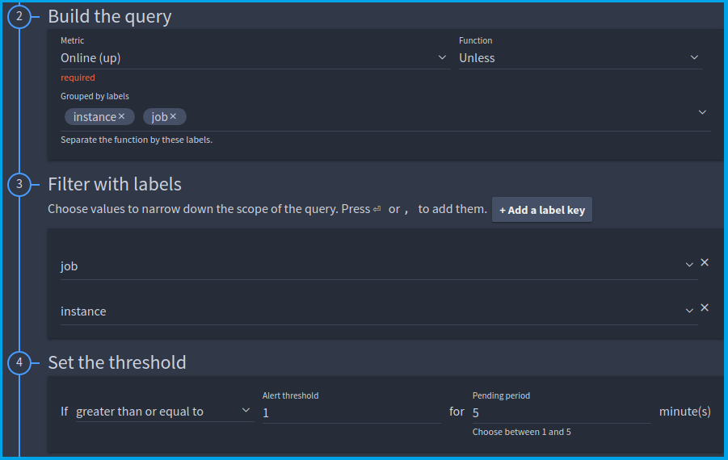
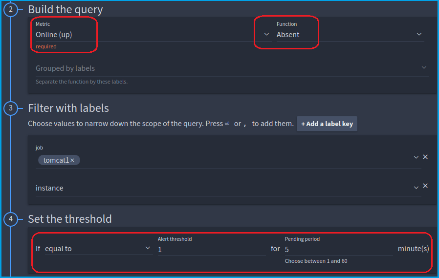
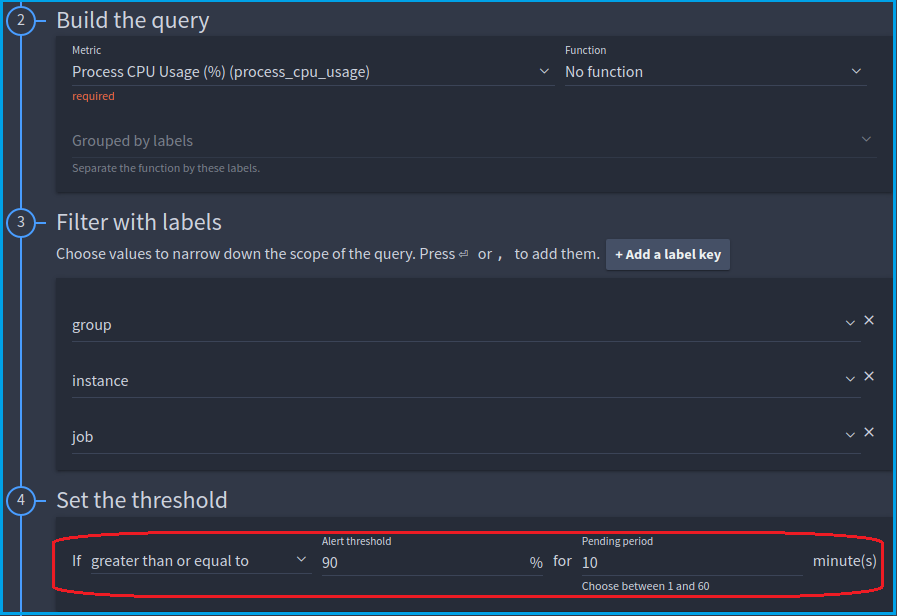
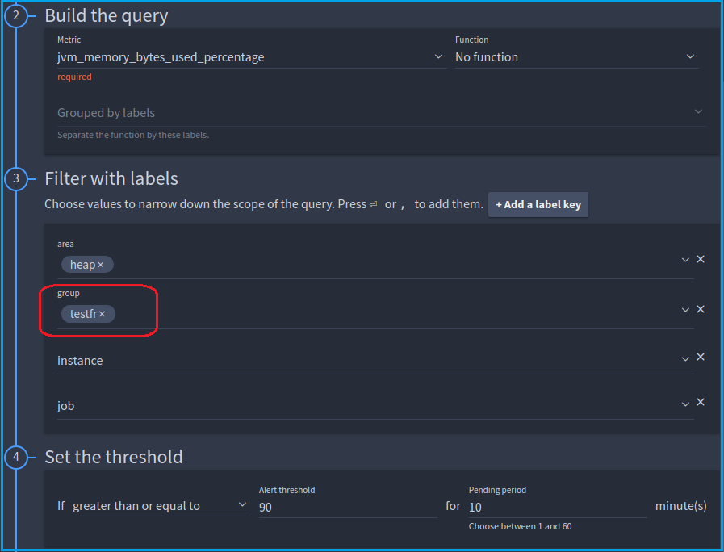

## 1. When any instance goes offline for 5 minutes 

The following example is a check that will monitor the online status of all FusionReactor instances using your Cloud license.

!!! note
    Any instance which has been offline for over five minutes will stop being counted as offline by the check.

To more reliably monitor the online status of a specific job/instance, see the [check below](alerting.md#when-a-single-instance-goes-offline).

It's also possible the graph will say **no data** when you are editing your check. This simply means no instances have gone offline within the time frame shown.

??? example "Example"
    

    * This check relies on the function **Unless**, which returns the value from 5 minutes ago when **no data** is present now.

    * The **Online (up)** series is generated by FusionReactor, indicating that it is online. Therefore, if the instance was online 5 minutes ago, but isn't online now, it is offline and data will be returned. The condition is met so an alert will be fired.

## 2. When a single job goes offline for 5 minutes

This example monitors the online status of an instance, and sends an alert if it goes offline. 

If you choose more than one **Job** or **Instance** with these alert conditions, then all of the selected jobs/instances must be offline for an alert to fire. 

It's possible the graph will say **no data** when you are editing your check. This simply means the selected instance has not been offline within the time frame shown.

??? example "Example"
    

    The important parts here are:

    * the function **Absent**, which returns **1** when **no data** is present, and the filter labels.

    * The **Online (up)** series is generated by FusionReactor, indicating that it is online. No data will be present when the instance is offline, so the absent function will return a **1** and cause an alert to be fired.

## 3. When any instance is using over 90% CPU for 2 minutes
In this example, we make use of the threshold value to have an alert that fires if an instance is using over 90% of the system CPU.

??? example "Example"
    

!!! tip
    Use "less than" threshold for underflow alerts (e.g., low request volume). This is useful for services that receive many requests, as low activity could be a sign that requests are not reaching your service.

## 4. When any instance in a group is using over 90% allocation memory for 10 minutes

Instances can be assigned a group which will appear as a label. In the example shown, **testfr** is the group set on several instances,
and each of those instances will be assessed by the check.

??? example "Example"
    