# Alerting

🔎**Find it**: **FusionReactor** > **Alerting**

<iframe src="https://player.vimeo.com/video/840075467?h=44f1e58e4b" width="640" height="363" frameborder="0" allow="autoplay; fullscreen" allowfullscreen></iframe>

**FusionReactor Cloud Alerting** allows you to create automated checks on the values of metric data gathered by a
FusionReactor agent, and generate alerts when user-made conditions are met.

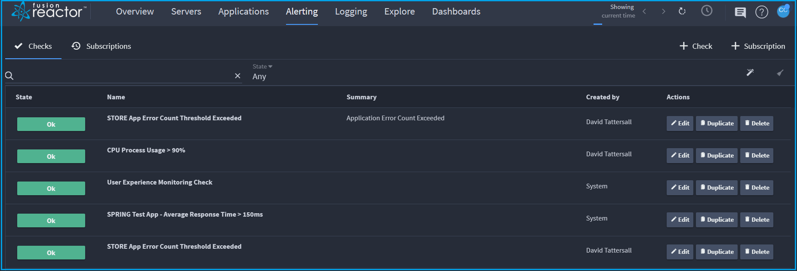

The alerting system is comprised of **Checks** and **Subscriptions**:

* [**Checks**](alerting.md#checks) are the conditions that are processed by the alerting engine.
* [**Subscriptions**](alerting.md#subscriptions) can be added to a check to notify via other services when an alert is generated.

The alerting area can be found by selecting **Alerting** in the navigation bar, while
[alerting service configurations](alerting.md#configuring-alerting-services) can be found by clicking **Configurations**.

!!! note
    It is necessary to set-up alerting services before you can
    start using them to make **Subscriptions**.

## Checks

🔎**Find it**: **FusionReactor** > **Alerting** > **Checks**

In the **Checks** screen, you can perform the following actions:  

* View a check.

* **Edit**, **Duplicate** or **Delete** a check.


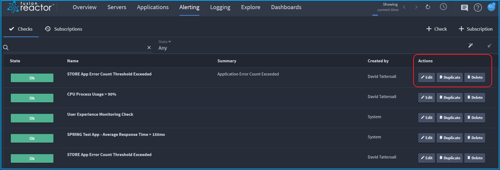

### Alert status

Hovering over the first icon at the right of the screen displays information about the alert.

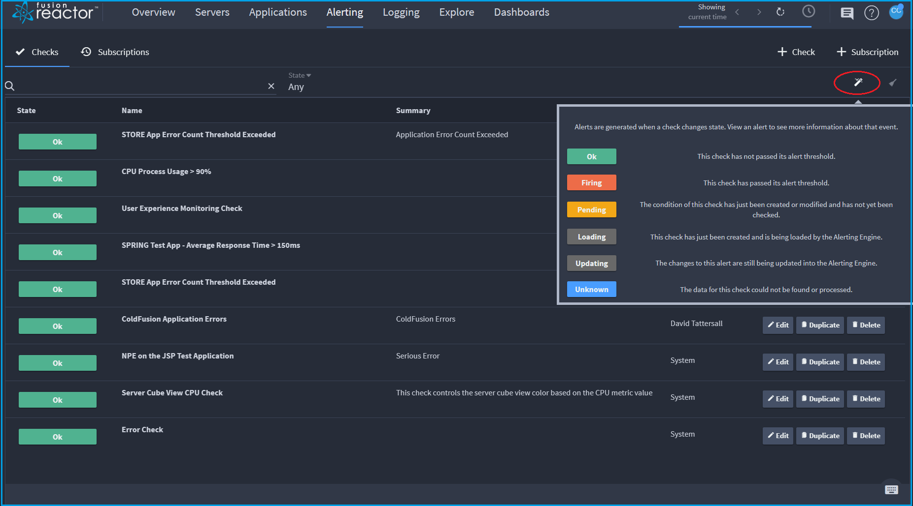

1. **Ok** - This alert has not passed its alert threshold.

2. **Firing** - This check has passed its alert threshold

3. **Pending** - The condition of this check has been created or modified and has not yet been checked.

4. **Loading** - This check has been created and is being loaded by the alerting engine.

5. **Updating** - The changes to this alert are still being updated
 into the alerting engine.

6. **Unknown** - The data for this check could not be found or processed. 

### Create a check 

🔎**Find it**: **FusionReactor** > **Alerting** > **Checks** > **+ Check**

To create a check, select **+ Check** on the top right of page.

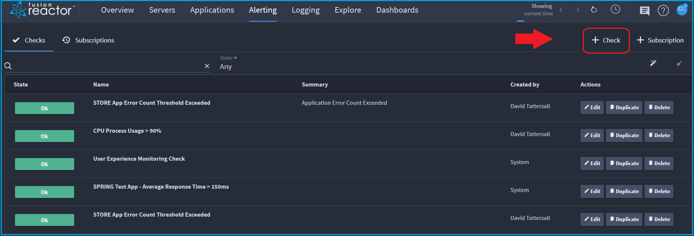

The **Create new check** screen is displayed.

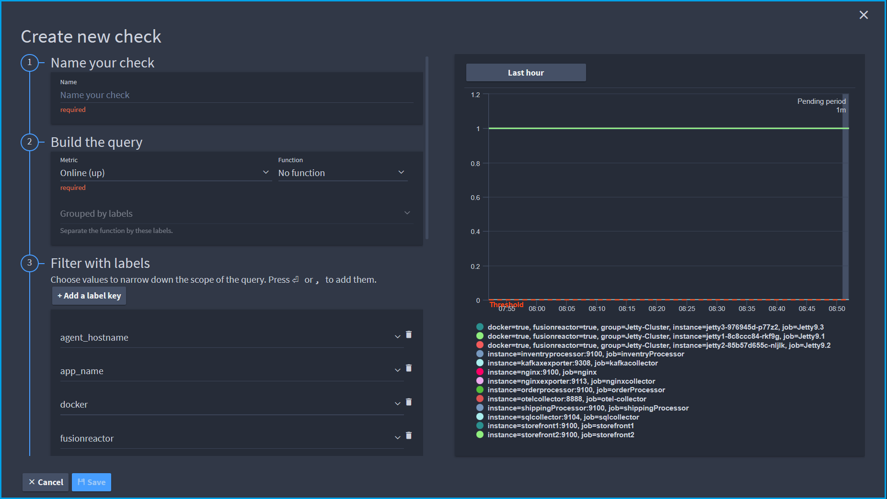

!!! tip
    We recommend only creating checks that fire when action to correct a situation is required. If you have too many alerts fire, we tend to find that alerts begin to be ignored. As a result crucial alerts that are important can be missed.

!!! info
    The alerting engine runs every 60 seconds.

There are two ways to set a query:

* [Builder](/frdocs/Data-insights/Features/alerting/#builder)

* [Code](/frdocs/Data-insights/Features/alerting/#code)

#### Builder

**Step 1: Name your check**

The first step in creating a check is naming it.

!!! tip
     Using a name that describes the situation firing the event is recommended.

**Step 2: Set your query**

The metrics list contains every metric that has been ingested into your cloud account

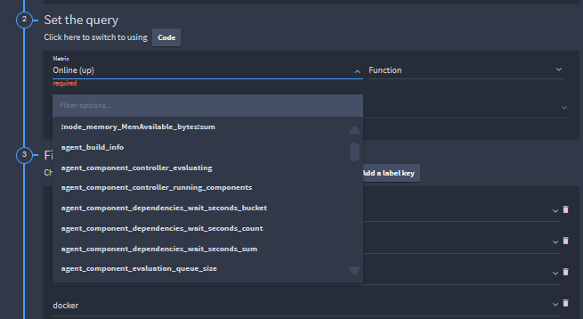

Functions can be applied to your metric if required.


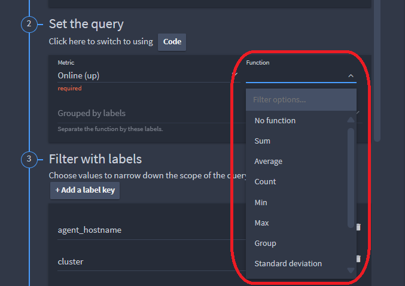

Functions include:

- **Sum**
- **Average**
- **Count**
- **Min**
- **Max**
- **Group**
- **Standard deviation**
- **Unless**
- **Absent**

The **Grouped by labels** dropdown will set which labels the data is grouped by, before a function is run on each group.

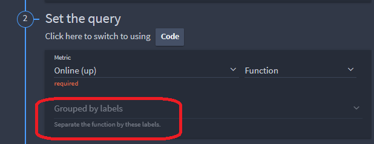

Any changes to your metric selection, function or group will be applied to the graph showing the metric state.

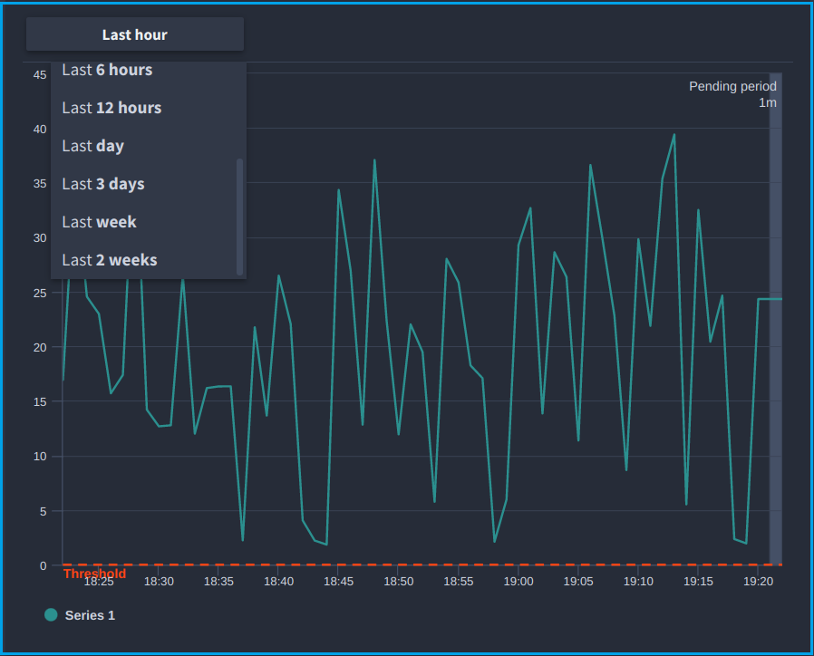

The timeframe of the metric can be adjusted from one hour, up to 2 weeks.

**Step 3: Filter with labels**

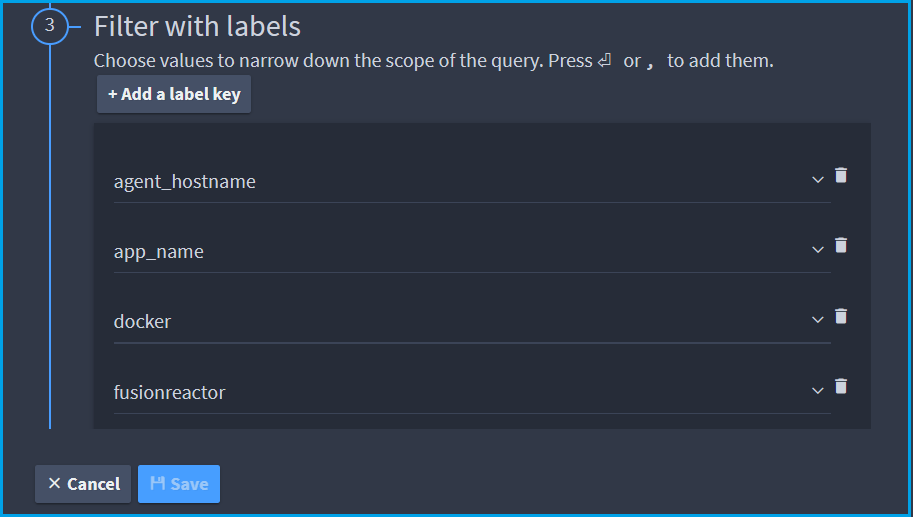

The alerting UI will display each label associated with your selected metric.

* Select one or more label values to narrow down the data being monitored by the alert. 

* Add your own key/value pairs with **Add a label key**.

* Selected labels will alter the metric graph values appropriately.

**Step 4: Set your thresholds**

Using the metric graph for reference, you can set your alert threshold.

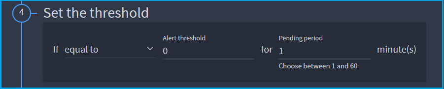

Use the selector to specify whether the value needs to be greater than, less than or equal to the threshold.

**Step 5: Add subscriptions**

Specify which of your existing subscriptions you would like your alert to be sent to, or alternatively create a new subscription.

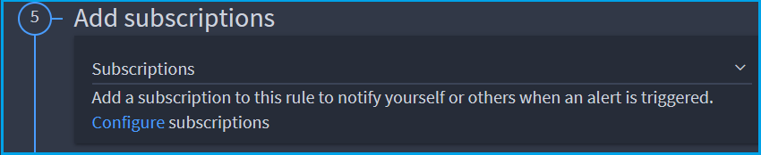

**Step 6: Optional configuration**

You can set a summary and runbook for your alert notification. These are optional.


- **Summary** is a short description of the check, so the receiver knows what the alert is about.
- **Runbook** is for a URL. This is usually the location of the resources/instructions for *What to do when this alert fires*.

The summary and runbook, if specified, will appear in your alert.

#### Code


**Step 1: Name your check**

The first step in creating a check is naming it.

!!! tip
     Using a name that describes the situation firing the event is recommended.

**Step 2: Set your query**

To build your query using PromQL, select the **code** button.


The following screen is displayed:

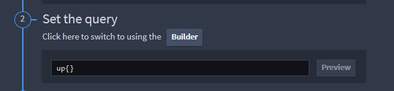

!!! example "Example Query"
    

**Step 3: Set your thresholds**

Using the metric graph for reference, you can set your alert threshold.


Use the selector to specify whether the value needs to be greater than, less than or equal to the threshold.

**Step 4: Add subscriptions**

Specify which of your existing subscriptions you would like your alert to be sent to, or alternatively create a new subscription.


**Step 5: Optional configuration**

You can set a summary and runbook for your alert notification. These are optional.


- **Summary** is a short description of the check, so the receiver knows what the alert is about.
- **Runbook** is for a URL. This is usually the location of the resources/instructions for *What to do when this alert fires*.


### Example checks

* [Performance checks](/frdocs/Data-insights/Features/alerting-examples/)
* [Billing/usage checks](/frdocs/Data-insights/Features/billing-check/)


### Edit and duplicate checks

**Edit** - Editing a check will provide you with a form identical to the form for creating one. It will be populated with the existing configuration of the check and when you save it the original check is overwritten.

**Duplicate** - Duplicate similarly shows the same form with the check's settings already filled in. Selecting **Save** when duplicating will create a new check instead.


## Alert services

🔎**Find it**: **FusionReactor** > **User Icon** > **Configuration** 

Subscriptions require a service they can send their subscribed alerts to. These are set-up in the configuration menu. 

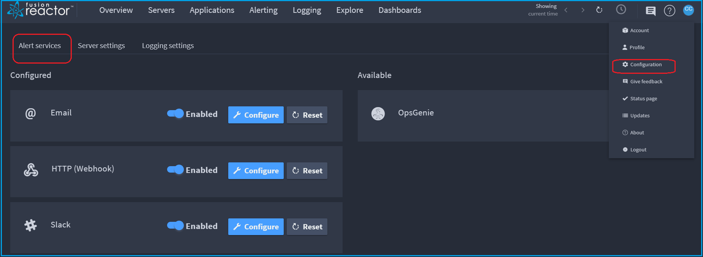


The following alerting services are currently supported:

* **Email**
* [Gitlab](https://about.gitlab.com/) (via Email)
* **HTTP** (Webhook)
* [Microsoft Teams](https://products.office.com/en-us/microsoft-teams/group-chat-software/) (via HTTP webhook)
* [Slack](https://slack.com/)

### Configure alerting services

Service configurations can be found under [Alert services]( https://app.fusionreactor.io/configuration/alerts) in the
**Configuration** menu. From there you can configure the services you wish to use when creating subscriptions.

To configure a service simply click the **Configure** next to that service.


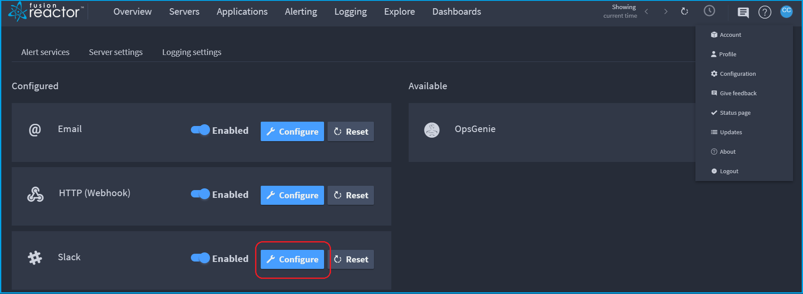

A menu like the one shown below will appear:

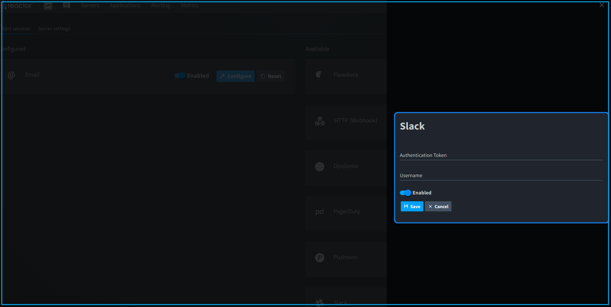

The required information differs for each service, and are explained in more detail below:


#### Email

* Simply enable the service.
* Email addresses are set during subscription creation.


#### Http (Webhook)

* Enter Webhook URL in the subscription during creation.

#### Slack 

!!! info "Learn more"
    [Slack](https://slack.com/)

For the FusionReactor Cloud Slack app:

* Click the **Add to Slack** button which will redirect you to the Slack website.

* If required, sign into Slack, then review the requested permissions and allow the app access to your workspace.

!!!note
    The FusionReactor Cloud app will only have permission to **view** the name, email domain, and icon for your workspace.
    **It cannot edit anything**.

    
!!! info "Learn more"
    [Slack api](https://api.slack.com/scopes/team:read)

!!!note
    If you have to request approval from your Slack workspace admin, you will have to repeat these steps. An admin can approve
    the request from the app management settings for your workspace or through a direct Slack message they will receive from **Slackbot**.
    
    After granting the app access, you will be redirected back to FusionReactor Cloud and your service will be configured.

### Disable alerting services

Clicking the toggle next to the service will switch it between being **Enabled** or **Disabled**.

When a service configuration is disabled, the following will happen:

* Each subscription that is linked to that service will be disabled. You will need to manually re-enable them after re-configuring the service.

!!!note
    You cannot re-enable the subscriptions until the service is enabled.

* The settings saved on that service will be kept, so no extra set-up is required when re-enabling them.

### Reset alerting services

You can reset the configuration for a service by selecting **Reset**  next to that service.

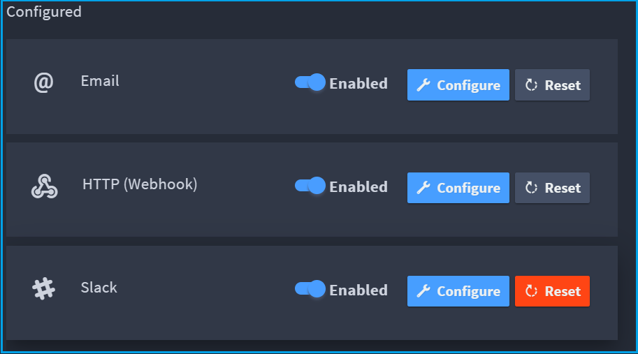


When a service configuration is reset, the following occurs:

* Each subscription that is linked to that service will be disabled. You you will need to manually re-enable them after re-configuring the service.

!!!note
    You cannot re-enable the subscriptions until the service is enabled.

* The settings saved on that service will be deleted, so any API keys and other information will need to be entered again when re-configuring them.

## Subscriptions

The subscriptions tab lets you manage and test your subscriptions.

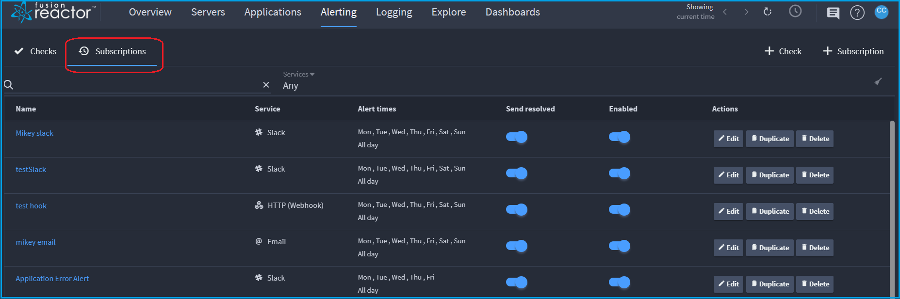

To view a subscription in more detail, select its name on the left-side of the row.

## Create subscriptions

Clicking the subscription button as shown below, will open the form for creating subscriptions. 

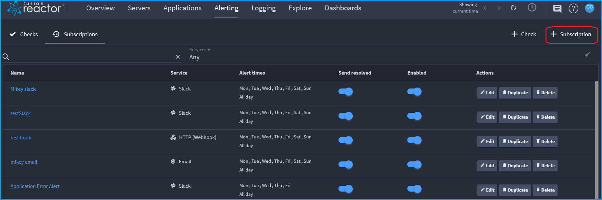

The **Create new subscription** screen is displayed:

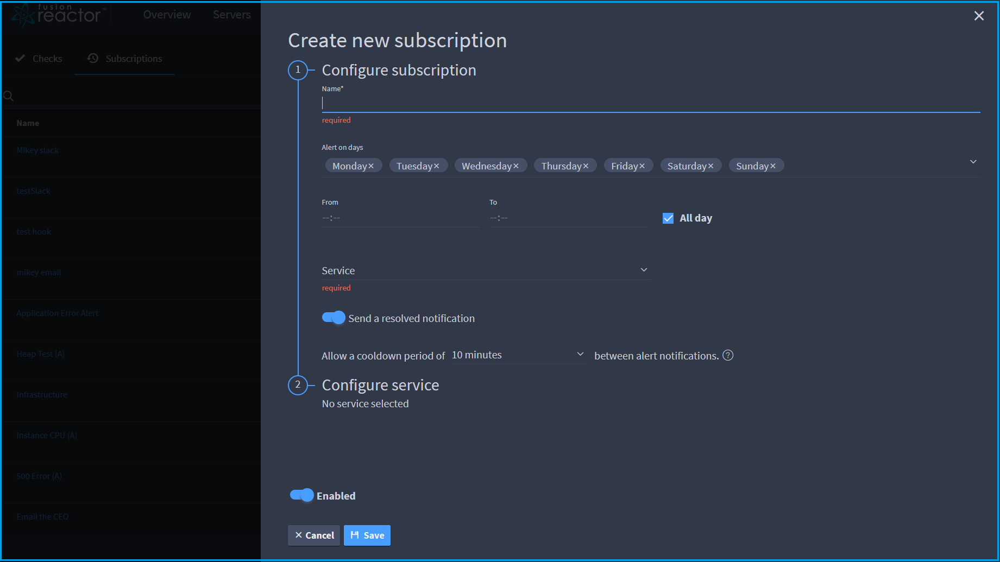

Within this form you will be able to set the active times and days of the subscription, as well as which alert states it watches for.

Messages will only be sent to the subscribed service of those conditions that are met by an alert. Each service has different properties that may be configured, and will be explained in more detail below.

### Email

* **Subject** is for the email subject, which is "FusionReactor alert" by default.
* **Addresses** is where you list the email addresses of recipients for the subscription.
* **key** and **value** fields let you enter internet/email message headers as key:value pairs.

### Gitlab

Gitlab supports creating issues via email.
Follow [this guide](https://docs.gitlab.com/ee/user/project/issues/managing_issues.html#new-issue-via-email) to find out how.

Flowdock doesn't require any additional configuration beyond the service configuration.

### HTTP Webhooks

* **Target URL** is required, as it is the URL that the alerts will be sent to. Your endpoint should provide this URL that
  can be simply copied and pasted into the **Target URL** field.
* **Header** is for the internet message headers attached to requests.
* **Body** is for the body of the request.

The end-point of the webhook will vary on what it requires, so be sure to check the documentation of your endpoint to
see what schema it follows. Then you can fill in the **Body** and **Header** to fit your needs.

### Microsoft Teams

To set-up alerting for MS Teams, you will need to set up a **Connector**. 

!!! info "Learn more"
    [Connectors](https://docs.microsoft.com/en-us/microsoftteams/platform/concepts/connectors/connectors-using#setting-up-a-custom-incoming-webhook)


Once you have the URL, enter it into your subscription as the Target URL, as mentioned above for [webhooks](alerting.md#http-webhooks).


#### JSON schema used for MS Teams message cards

!!! example
    Copy and paste this into the **Body** of the webhook, or create your own. 


    ```json
    {
        "@type": "MessageCard",
        "@context": "https://schema.org/extensions",
        "summary": "FusionReactor Cloud Alert",
        "themeColor": "479eff",
        "sections": [
            {
                "activityTitle": "FusionReactor Cloud",
                "activitySubtitle" : "My alert title",
                "activityImage": "https://www.fusion-reactor.com/wp-content/uploads/2013/01/frico1.png",
                "text": "This text is here as a placeholder example of the webhook schema for MS Teams."
            }
        ],
        "potentialAction": [
            {
                "@type": "OpenUri",
                "name": "View alerts",
                "targets": [
                    {
                        "os": "default",
                        "uri": "https://app.fusionreactor.io/alerting/alerts"
                    }
                ]
            }
        ]
    }
    ```

    Resulting output:

    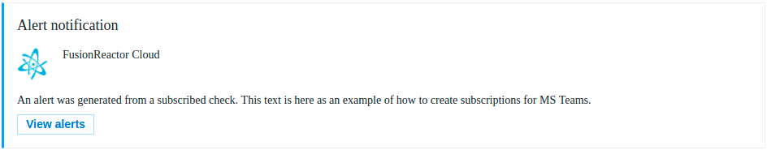


!!! info "Learn more"
    [Create message card](https://docs.microsoft.com/en-us/outlook/actionable-messages/message-card-reference#card-examples).


### Slack

For the FusionReactor Cloud Slack app:

* Select **Add to Slack** which will redirect you to the Slack website.
* If required, sign into Slack, and then select the channel you want alerts to appear in.
* After, you will be redirected back to FusionReactor Cloud where you can continue to configure your subscription.

### Edit and duplicate subscriptions

Clicking the **Edit** button on the row of the subscription you wish to edit will present you with an interface just like
the one used to [create subscriptions](/frdocs/Data-insights/Features/alerting/#create-subscriptions).

The values shown will match what's currently set on the subscription. Once you've made your desired changes, simply
click **Save** and your changes will overwrite on the subscription.

If you don't wish to overwrite the existing subscription you can click **Duplicate**. The values shown will match what's currently set on the subscription you chose. You can changes before saving it.

Clicking **Save** at the end of the form, creates a new subscription.

### Delete and disable subscriptions

Clicking **Delete** results in a message requesting confirmation that you wish to delete the subscription. Choosing **Ok** will delete the subscription from your account.

!!! warning
    This *cannot* be undone.

Clicking the toggle under **Enabled** will enable or disable the subscription. The check will appear blue when enabled.

While disabled, checks will not send alerts to that subscription and the subscription will not appear when looking at a check in the detailed view.

If the [alert service](alerting.md#alerting-services) used by the subscription is not configured, or disabled, then the
subscription will be automatically disabled and cannot be enabled until the service is configured and enabled.

___


!!! question "Need more help?"
    Contact support in the chat bubble and let us know how we can assist.
