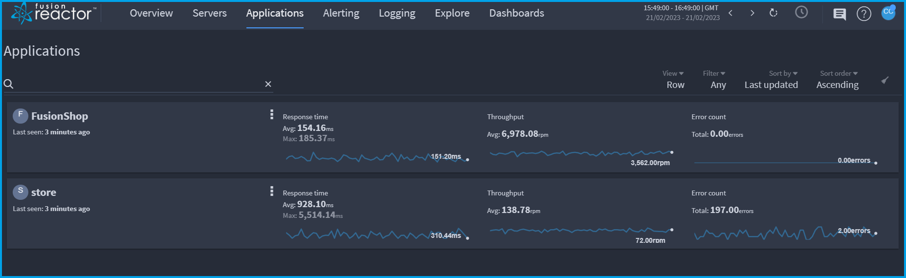
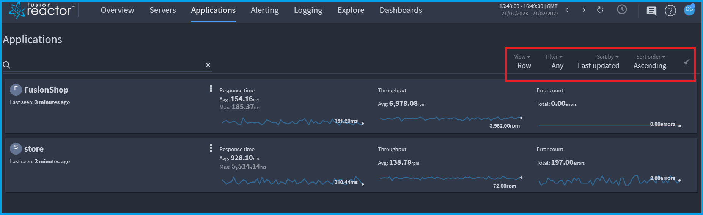
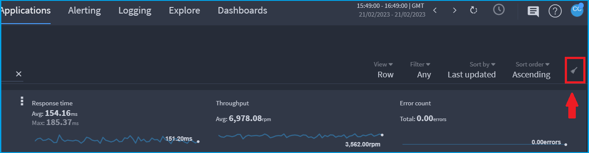
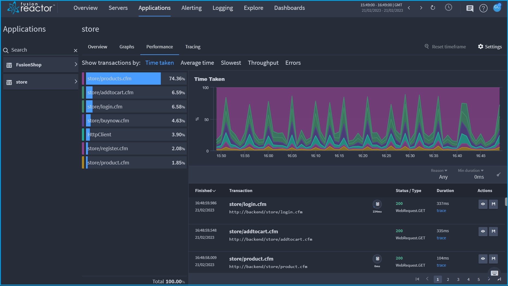
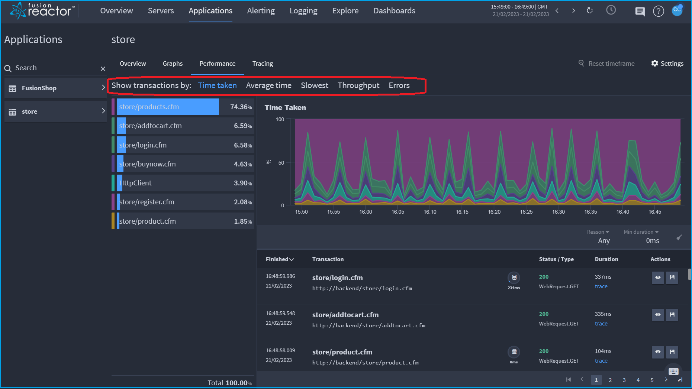
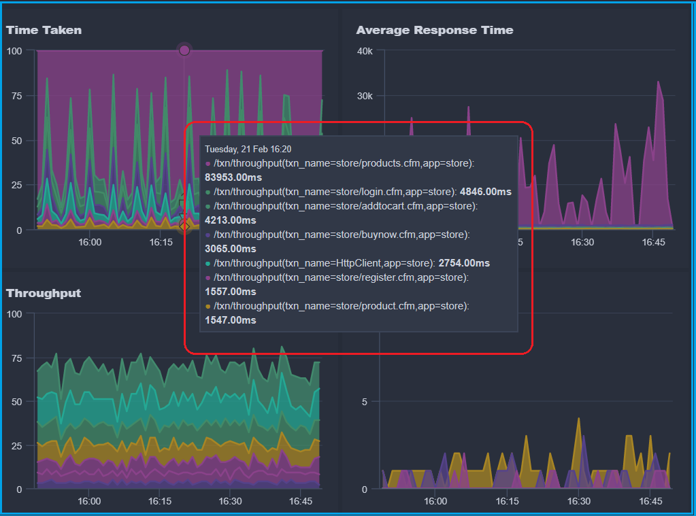
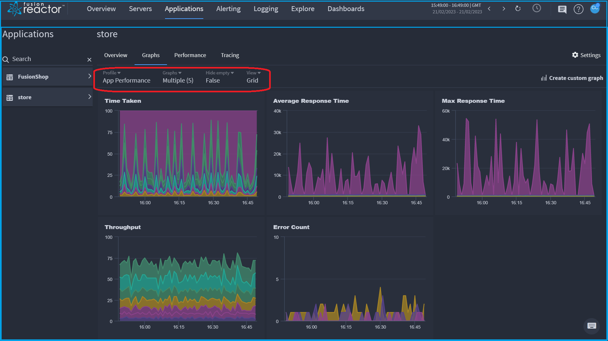
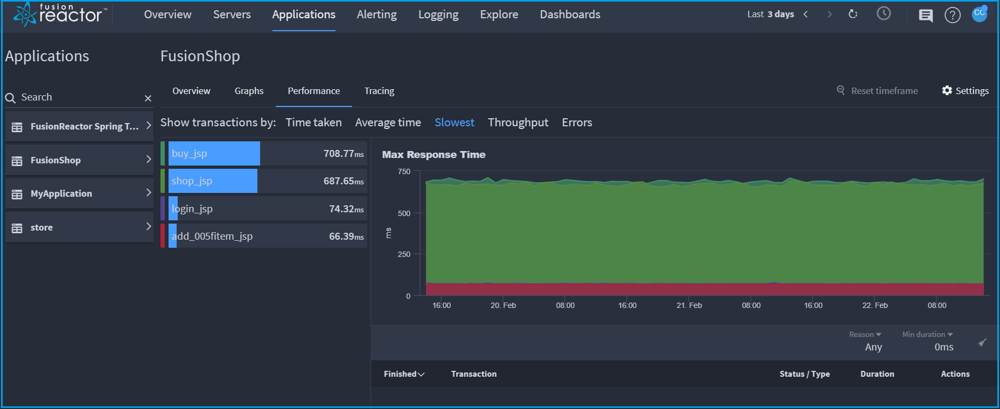

# Applications

🔎**Find it**: **FusionReactor** > **Applications**

The **Applications** list view on FusionReactor Cloud displays an overview of all your applications on servers running FusionReactor.

## Applications filtering

Applications can be filtered by **View**, **Filter**, **Sort by** and **Sort order**.

* In the **View** dropdown, you can choose to display your applications in either a **Grid** or **Row** view. 

* Use the **Filter** dropdown to filter the applications in a state of **Slow** or **Error**. 

* You can also filter for applications that have been **deleted**. 

* Use the **Sort by** dropdown to filter applications by:

    1. **Attribute** 

        * Name

        * Last updated

    2. **Metric**
        * Request throughput
        * Error count
        * Average response

        * Max response

* In the **Sort order** dropdown, you can view your applications in **Ascending** or **Descending** order.

* To clear all filters, select the icon at the far right of the screen.

!!! tip
    Search directly for an application **name** (or **alias**) using the search box inside the filter bar.

## Applications details 

The applications details screen is displayed when an application is selected.

## Transaction bars

🔎**Find it**: **FusionReactor** > **Applications** > **Performance**

The transaction list displays all the transactions associated with that application for the set timeframe as well as the selected tab in the filter bar. 

Transactions can be filtered by selecting the relevant tab:

1. **Time taken** - This displays the percentage of time the application running that transaction.
2. **Average time** - This shows the average time for each transaction, with a line displayed across all transactions showing the average for the entire application. The application average time is displayed below the transaction list.
3. **Slowest** - This displays the longest response time for each transaction, with the total of the longest times shown below the transactions list.
4. **Throughput** - This shows the number of requests for each transaction, with the total number of requests displayed below the transaction list.
5. **Errors** - This displays the number of errors for each transaction that has caused errors, with the total number of errors displayed below the transaction list.

## Transactions graphs

🔎**Find it**: **FusionReactor** > **Applications** > **Graphs**

The graph data is displayed by:

* **Time Taken**

* **Average Response Time**

* **Max Response Time**

* **Error Count**

The graph can be manipulated in a number of ways:

1. Hovering the mouse over the graph will show all the data for that time point. 

2. The graphs can be filtered by:

* **Profile** - either **System** or **Custom**

* **Graphs**  - **Average Response Time**, **Error Count** and more...

* **Hide empty** - either **True** or **False**

* **View** - **Grid** or **Row**

## **Interesting transactions**

This list shows all the interesting transactions related to the selected application. 

A transaction is regarded as *interesting* if it is:
 
1. **Slow** - The slowest four transactions over 500ms for every minute.
2. **Very slow** - The first four transactions over the slow request threshold as set in the FR Client (by default this is 8 seconds) for every minute.
    * Set the threshold in the FR client by going to **Requests** > **Settings** > **WebRequest History** > **Slow Request Threshold** (seconds).
3. **Error** - The transaction returned an error.

The following information is displayed by the interesting transactions list:

1. **Started** - The start time and date of the transaction.
2. **Status** - The status code that the transaction returned, for example 200, 500, etc.
3. **Flavor** - The type of transaction, for example Web Request, JDBC request, etc.
4. **Txn (Transaction)** - Transaction name.
5. **Description** - A description of the transaction. For example, the URL of the request, database query, etc.
6. **Reason** - The reason the transaction is interesting (Slow, Very slow or Error).
7. **Dur (Duration)** - Duration of the transaction in MS.
8. **Actions** - Two actions:

    * View the details page of that transaction.
    * Save the transaction under the saved transactions view for that application / instance.

## Filtering

The interesting transactions list has two ways to filter and sort it:

1. The **Reason** dropdown will filter by reason type, with the options of **Slow** and **Errors**.

2. The **Min duration** dropdown will filter the list to only show transactions with a duration time over the specified time.
 
!!! question "Need more help?"
    Contact support in the chat bubble and let us know how we can assist.