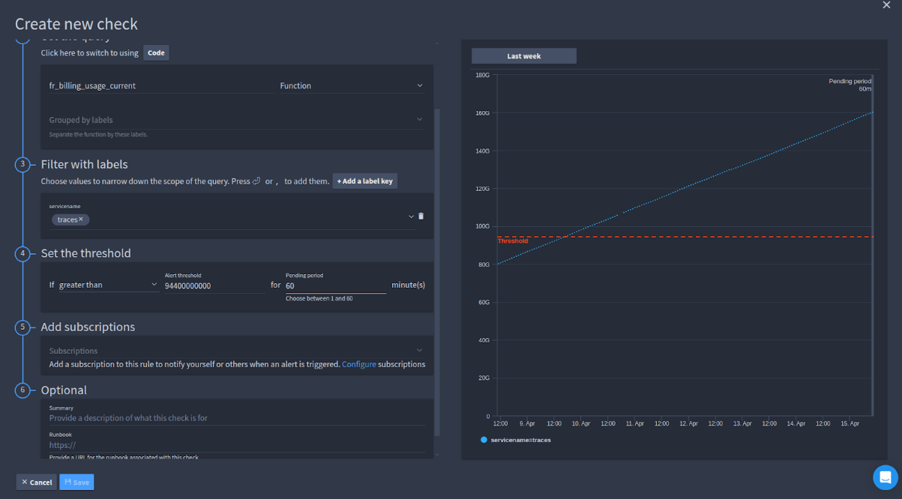
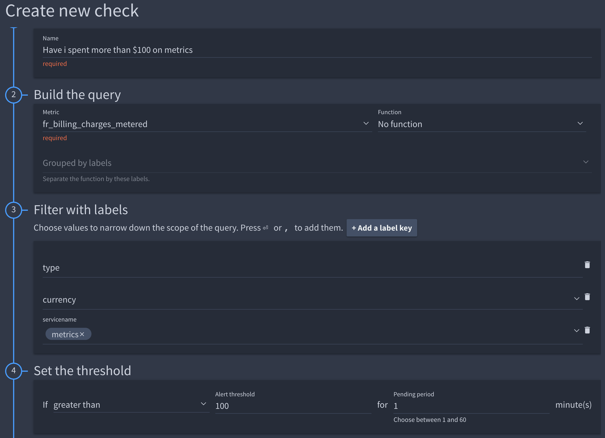
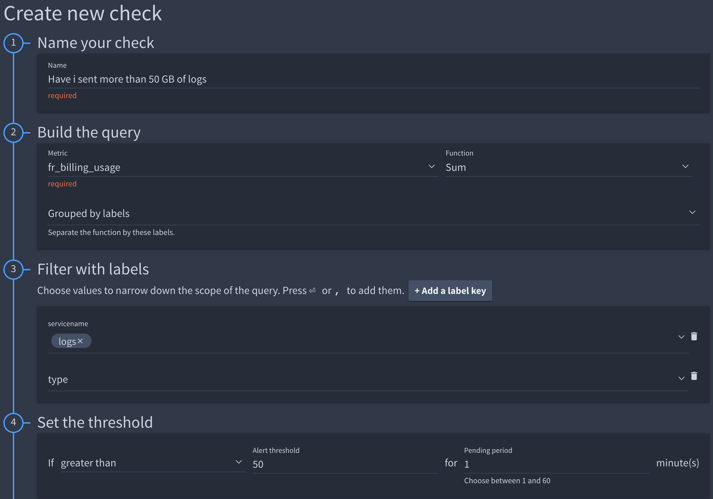

# Billing usage checks

## Configuring usage-based billing alerts in FR Cloud

This document describes how to configure alerts in FusionReactor Cloud to monitor your monthly usage of metrics, traces, logs, and agents, ensuring you stay within your allocated limits.

**Procedure:**

1.  **Navigate to the Alerting section:**
    * In the FusionReactor Cloud interface, access the **Alerting** tab.

2.  **Create a new check:**
    * Click the **Create Check** button to initiate the alert configuration.

3.  **Specify the billing usage metric:**
    * In the "Create new check" screen, locate the **Metric** field.
    * Set the metric to `fr_billing_usage_current`. This metric represents the current monthly usage.

    

4.  **Filter by service name:**
    * Under the "Filter with labels" section:
        * Set the filter label to `servicename`.
        * Specify the exact service name for which you want to monitor usage.
        * In the pictured example you'll see that the “traces” label has been selected.

    !!! warning 
        Failure to specify a `servicename` will result in aggregated usage across all services, leading to inaccurate alerts.

6.  **Define the threshold:**
    * Under the "Set the threshold" section:
        * Set the **Operator** to `greater than`.
        * Specify the **Threshold** value in bytes.

    !!! Example
        To trigger an alert when trace usage reaches 80% of a 100GB limit, set the threshold to `80000000000` bytes (80GB * 1,000,000,000 bytes/GB).

7.  **Name and configure notifications:**
    * Provide a descriptive **Name** for the check.
    * Configure **Subscriptions** to specify how and where alerts should be delivered (e.g., email, Slack).

8.  **Activate the alert:**
    * Save the check configuration. The alert is now active and will trigger when the specified usage threshold is exceeded.

## Example alert configurations

The following are examples of specific billing alert configurations using different metrics:

### On-demand usage alert

Triggers an alert based on on-demand usage charges, using the `fr_billing_charges_metered` metric.

??? example "Example"
    

    * Monitors on-demand usage costs.

### Billable data usage alert

Triggers an alert based on total billable data usage, using the `fr_billing_usage` metric.

??? example "Example"
    

    * Monitors the total amount of data subject to billing.

### Total billing charges alert

Provides information on total current billing charges, using the `fr_billing_charges_total` metric.

