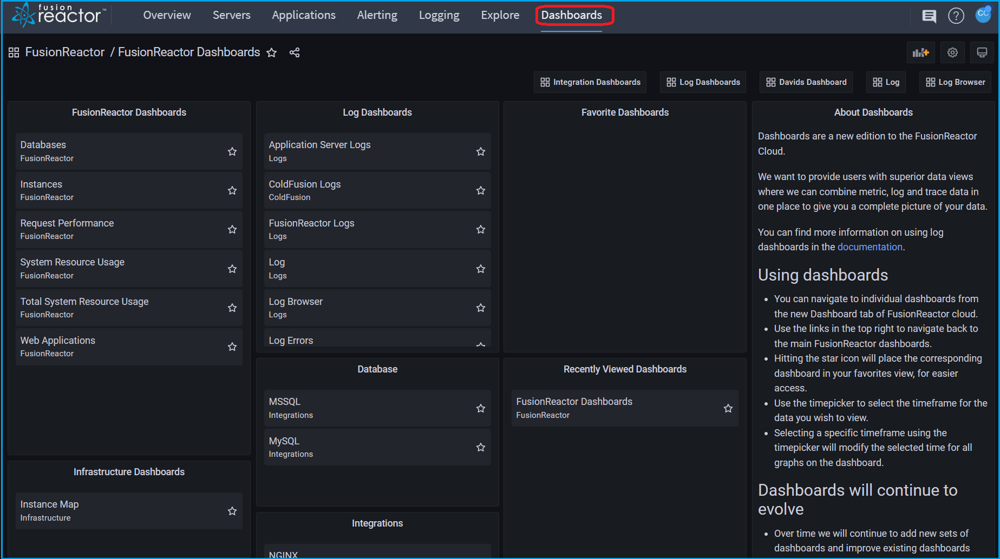
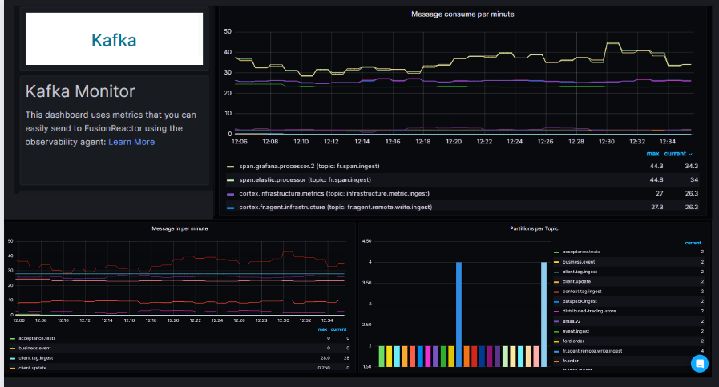

# Overview

**Dashboards** allow you to visualize your Cloud data with superior, unparalleled depth.

Combine metrics, logs and traces in one place to give you a complete picture of your data.

<iframe src="https://player.vimeo.com/video/840492282?h=b7752d4c21" width="640" height="363" frameborder="0" allow="autoplay; fullscreen" allowfullscreen></iframe>

## Central FusionReactor dashboard

**Find it**: **FusionReactor** > **Dashboards**

The central **Dashboard** contains links to all dashboards and can be used to quickly navigate between all dashboards.

Log dashboards will be added and improved over time, including adding new categories of dashboards, new log views and new filters to gain insight and value from your logs.

### Using dashboards

Navigate to individual dashboards from the new **Dashboard** tab of FusionReactor Cloud. Use the links in the top right to navigate back to the main FusionReactor dashboards.

The dashboard user interface provides a number of features that you can use to customize the presentation of your data.

The following image and descriptions highlights all of the dashboards features.

1. **Dashboard title**: When you click the dashboard title you can search for dashboard contained in the current folder.

2. **Star icon**: This feature allows you to place the corresponding dashboard in your favorites view, for easier access.

3. **Share dashboard**: Use this option to share the current dashboard by link or snapshot. You can also export the dashboard definition from the share modal.

4. **Add a new panel**: Use this option to add a panel, dashboard row, or library panel to the current dashboard.

5. **Dashboard settings**: Use this option to change dashboard name, folder, and tags and manage variables and annotation queries. 

6. **Time picker dropdown**: Click to select relative time range options and set custom absolute time ranges. Highlighting a specific timeframe of a chart will modify the timeframe for all graphs on the dashboard.

7. **Zoom out time range**: Click to zoom out the time range. 

8. **Refresh dashboard**: Click to immediately trigger queries and refresh dashboard data.

9. **Refresh dashboard time interval**: Click to select a dashboard auto refresh time interval.

10. **View mode**: Click to display the dashboard on a large screen such as a TV or a kiosk. View mode hides irrelevant information such as navigation menus.

## Dashboard index

### FusionReactor dashboards

**Databases** - Observe database activity including throughput, time, total queries and error rate, broken down by database, collection / table and action.

**Instances** - Observe throughput, response time and error count broken down per instance.

**Request Performance** - Observe throughput, response time and error count, broken down by application, txn route and status code.

**System Resource Usage** - Observe the CPU, memory, GC and JIT statistics broken down by instance or application.

**Total System Resource Usage** - Observe the CPU, memory, GC and JIT statistics for your entire application stack.

**Web Applications** - Observe throughput, response time and error count broken down per application.

### Infrastructure dashboards 

**Instance Map** - Observe instance health based on process CPU, system CPU or JVM memory usage. This view is similar to what you would see in the Enterprise Dashboard 

### Log dashboards

For the list of log dashboards see the [log dashboard index](#). 

### Integration dashboards

**MySQL** - Observe metrics from the [MySQL exporter](/frdocs/Monitor-your-data/Observability-agent/overview/#exporters).

**MSSQL** - Observe metrics from the [MSSQL exporter](/frdocs/Monitor-your-data/Observability-agent/overview/#exporters).

**Node exporter** - Observe metrics from the [Node exporter](/frdocs/Monitor-your-data/Observability-agent/overview/#exporters)

**NGINX community** - Observe metrics from the [NGINX exporter](/frdocs/Monitor-your-data/Observability-agent/overview/#exporters)

**NGINX pro** - Observe metrics from the [NGINX exporter](/frdocs/Monitor-your-data/Observability-agent/overview/#exporters)

**Kafka** - Observe metrics from the [Kafka exporter](/frdocs/Monitor-your-data/Observability-agent/overview/#exporters)

**OracleDB Monitor**- Observe metrics from the [OracleDB Monitor](/frdocs/Monitor-your-data/Observability-agent/overview/#exporters)

### Experimental dashboards

Some dashboards have been marked as experimental, this allows us to continually roll out new concepts for dashboards.

These dashboards may contain issues, as we continue to refine and develop them.

___

!!! question "Need more help?"
    Contact support in the chat bubble and let us know how we can assist.