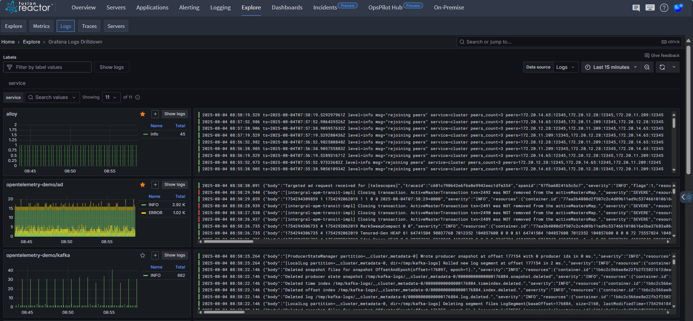

# Overview

FusionReactor’s **Logs Drilldown** makes log exploration effortless with an intuitive, no-query interface. It automatically turns your log data into interactive visualizations, enabling engineers of all experience levels to investigate and gain insights—no LogQL required.

## Key features

- Easily find logs and log volumes across all your services.

- Effortlessly filter logs by labels, fields, or patterns.

- Drill into data using volume trends and text patterns.

- Uncover related logs and track changes over time.

- Browse auto-generated visualizations tailored to your log data.

- Skip the LogQL - no queries required.

## **Getting Started with Logs Drilldown**

1. **Open Logs Drilldown**

    * From the FusionReactor Cloud dashboard, go to: **Explore → Logs**
    * This opens the **Overview page** showing time series and log visualizations for all services in your selected Loki data source.

    > ⚠️ If no services appear, make sure a Loki data source is connected.

2. **Select a data source**

    * At the top left, choose your **Loki data source** (if you have more than one).

    > Note: Logs Drilldown only supports **Loki**.

3. **Set a time range**

    You can adjust the time range in two ways:

    * Use the **time range picker** (top right).
    * Click and drag on a **time series chart** to zoom into a specific time window.

4. **Find a service**

    * Browse services by **log volume**
    * Or use the **Search Services** field to find a service by name
    * To view services by label instead, click **+ Add label**, then choose or search for a label

5. **View logs for a service**

    * Click **Show logs** on any service chart
     → This opens the **Logs tab** for that service, showing raw logs

6. **Explore labels**

    * Click the **Labels** tab to see log volume by label
    * To drill into a specific label, click **Select** to view volume by label value

    > Useful for understanding trends across environments, components, etc.

    !!! info "Learn more"
        [Labels](https://grafana.com/docs/grafana/latest/explore/simplified-exploration/logs/labels-and-fields/)

7. **Explore fields**

    * Go to the **Fields** tab to view logs grouped by field
    * Click **Select** next to any field to explore details like frequency or trends

    !!! info "Learn more"
        [Fields](https://grafana.com/docs/grafana/latest/explore/simplified-exploration/logs/labels-and-fields/)

8. **Explore log patterns**

    * Click the **Patterns** tab to see automatically detected log patterns
    * You can:

        * Focus on useful patterns
        * Hide noisy or repetitive ones

    > Great for identifying common issues or anomalies in log content

    !!! info "Learn more"
        [Patterns](https://grafana.com/docs/grafana/latest/explore/simplified-exploration/logs/patterns/)
