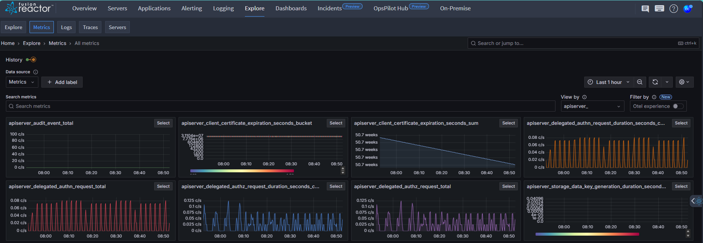
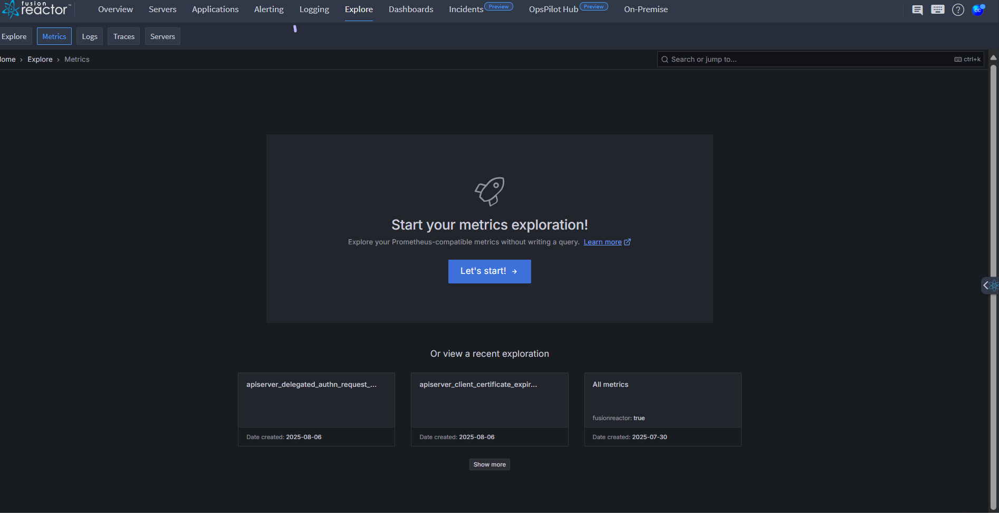
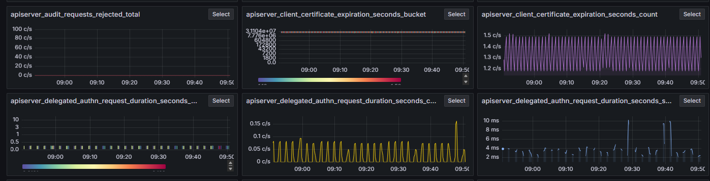
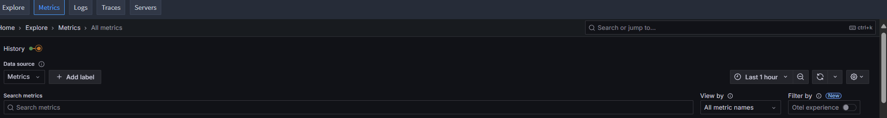
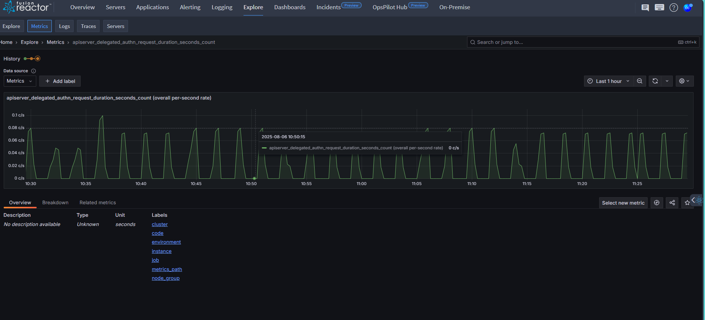
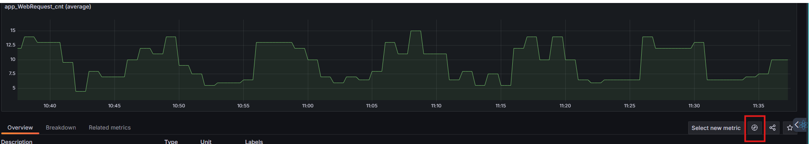
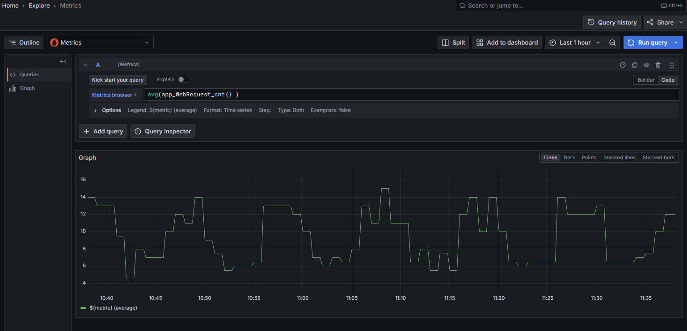
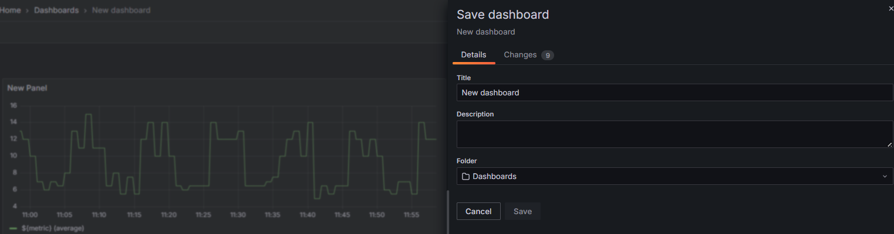

# Overview

FusionReactor’s **Metrics Drilldown**  offers a seamless, query-free way to explore Prometheus-compatible metrics. With just a few clicks, you can uncover related metrics and insights - no need to write a single PromQL query.

## Key features

- Segment metrics by labels to quickly spot anomalies and pinpoint issues.

- Auto-visualize metric types (e.g., gauges vs. counters) with no manual configuration.

- Discover related metrics to broaden context and deepen analysis.

- Pivot seamlessly to related telemetry, including logs, for end-to-end visibility.

## Getting started

At the top center of the screen, you'll see a welcome panel:

* Click the **Let’s start!** button to open the **Explore > Metrics** interface.
* A dynamic grid of metric panels is displayed, each representing a specific Prometheus metric (e.g., apiserver_client_certificate_expiration_seconds_count, apiserver_audit_event_total, apiserver_delegated_authz_request_duration_seconds).
    
* Below the launch panel, you’ll see a list of your **recently run metric queries** for quick re-access. 

### Search & filter metrics

Use search and filters to quickly narrow down the metrics you want to investigate - by system, service, or time frame. This helps you focus on what matters most.

To filter:

* Use the Filter by label values dropdown to select specific services or tags.

* Or type in the Search metrics box (e.g., type cpu), then press **Enter**.

Matching metrics will appear. From here, you can dive deeper into your analysis.

###  Investigate the data

Once you've filtered your metrics, it’s time to analyze the data for patterns or unusual behavior. Understanding your system’s normal (baseline) performance makes it easier to spot issues.

To start:

1. Review the metric panels and look for ones with noticeable changes.

    * Metrics with little variation (e.g., JVM Uptime) are typically less insightful.

    * Focus on dynamic and performance-critical metrics (e.g., CPU Usage, Heap Memory Used, Active JDBC Connections, or Request Throughput) to uncover system trends and potential issues.hat show clear trends.

2. Click **Select** on a metric to view it in more detail.
    
3. Adjust the time range using the time picker in the top right if needed.

4. Use the **Breakdown** and **Related metrics** tabs:

     * **Breakdown:** Visualizes each label-value pair for the selected metric. You can drill down further or add filters directly.
     * **Related metrics:** Lists similar metrics based on keywords. You can continue your analysis from here.

    

### Open a metric in Explore

Explore lets you interact with your data in real time. You can build, test, and refine queries without needing to create a dashboard. If your data source supports it, you’ll see results in both graph and table views—perfect for quick and detailed analysis.

To drill deeper into a specific metric using Explore:

1. Click **Select** on the metric panel you want to investigate in more detail.

2. Once the panel expands, click the explore icon in the bottom-right corner of the graph.

    
    

3. This opens the metric in **Explore** view, where you’ll see the full query.

4. From here, you can modify the query, change the time range, and switch between graph and table views to further analyze the data.

     

Explore is great for experimenting with queries and uncovering deeper insights—without needing to build a full dashboard.

### Add metrics visualization to a dashboard

1. At the top of the **Explore** page, click **Add to dashboard**.

2. Choose one of the following:

    * New dashboard – to create a new one

    * Existing dashboard – and pick one from the list

3. Click **Open dashboard** to view it.

4. Click **Save dashboard** in the top-right corner.

5. Give your dashboard a name and description, choose a folder (if needed), and click **Save**.

     

!!! info "Learn more"
    [Metrics](https://grafana.com/docs/grafana/latest/explore/simplified-exploration/metrics/)