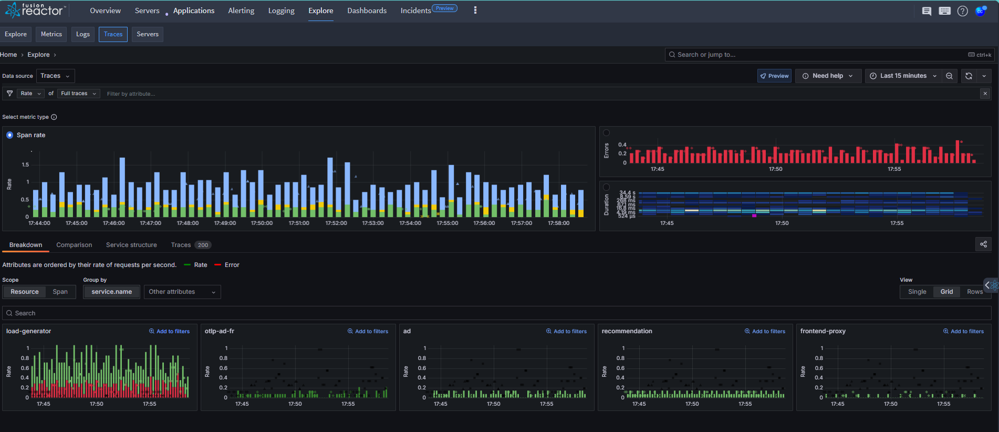
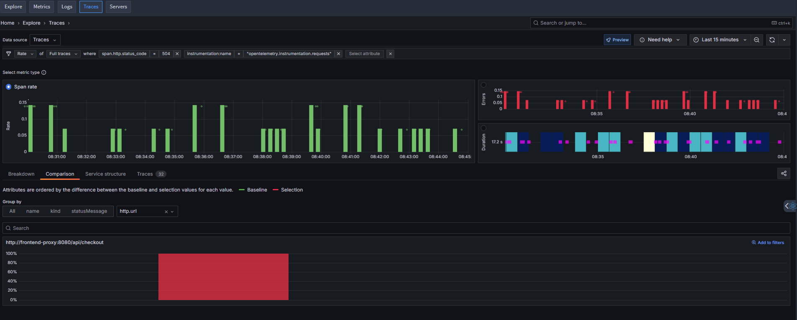

## Overview

Distributed traces enable you to monitor and troubleshoot applications by following the path of requests as they travel through various services. Each trace captures detailed information about a request—such as timing, errors, and service interactions - providing valuable context to help you diagnose performance issues or pinpoint failures.

FusionReactor's **Traces** feature enhances your observability workflow by offering intuitive visualizations of trace data collected by Grafana Tempo. It helps you quickly identify bottlenecks, latency spikes, and service dependencies, giving you actionable insights directly from your distributed traces.

 

## Key features

Using Traces in Explore, you can: 

- Leverage Rate, Errors, and Duration (RED) metrics derived directly from trace data to investigate and understand application behavior.

- Identify related issues and monitor how they evolve over time for proactive troubleshooting.

- Explore your data through automatically selected visualizations tailored to the metric type and structure.

- Get powerful insights without the need to write TraceQL queries - everything works out of the box.

## Get started

Most investigations follow a few core steps:

1. **Select the primary signal**: Begin by identifying the key signal to focus your investigation.

2. **Choose a metric**:
   Select from Rate, Errors, or Duration (RED metrics) to guide your analysis.

3. **Apply filters**:
   Refine your view by filtering on relevant labels or dimensions.

4. **Drill down into the issue**:
   Use the structural view or trace list to explore detailed trace data and uncover the root cause.

 

### Need a worked example?

If you want a step-by-step example of investigating the source of errors, [click here](https://grafana.com/docs/grafana-cloud/visualizations/simplified-exploration/traces/get-started/#example-investigate-source-of-errors) to see a detailed walkthrough using real trace data.
