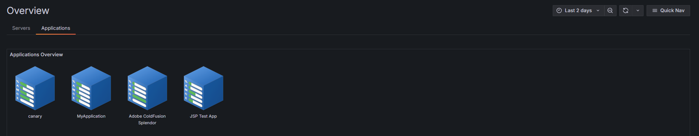
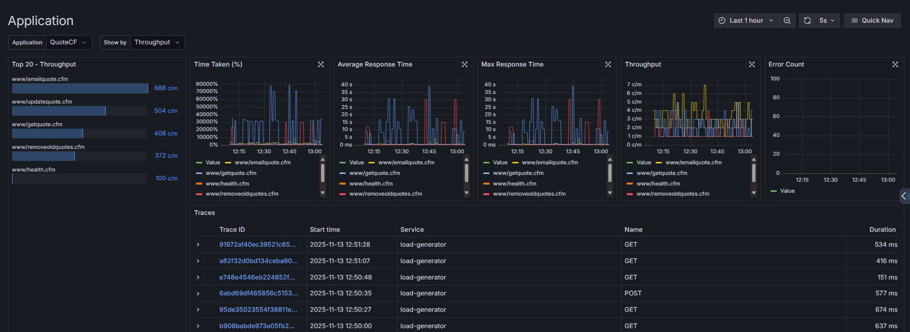
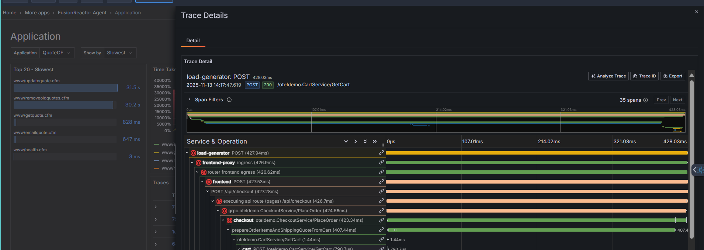

# Applications

The **Applications Overview** page provides a high-level visualization of all monitored applications within your environment. Each application is represented by a 3D cube, allowing users to quickly assess performance metrics such as throughput, transaction count, and error rates.

 

## **Key Elements**

Each cube represents a monitored application instance. Hovering over a cube displays detailed metrics in a tooltip, including:

| Metric                         | Description                                                                                    |
| ------------------------------ | ---------------------------------------------------------------------------------------------- |
| **App Name**                   | The name of the application being monitored.                                                   |
| **App Txn Throughput Sum Max** | Maximum cumulative throughput (transactions per minute) recorded over the selected time range. |
| **App Txn Throughput Avg**     | Average transaction throughput across the selected period.                                     |
| **App Txn Throughput Max**     | Peak transaction throughput observed.                                                          |
| **App Txn Throughput Cnt**     | Current transaction count per minute (c/min).                                                  |
| **App Txn Error Count Sum**    | Total number of errors recorded for this application.                                          |

## Toolbar Controls

Located at the top-right of the Applications Overview page are several key controls for time and data refresh management.

| **Control**               | **Description**                                       | **Options / Function**                                                   | **Notes**                                                                                        |
| ------------------------- | ----------------------------------------------------- | ------------------------------------------------------------------------ | ------------------------------------------------------------------------------------------------ |
| **Time Range Selector**   | Adjusts the time frame of displayed data.             | - Last 5 minutes - Last 15 minutes - Last hour - Custom range   | Selecting a new range automatically updates all metrics.                                         |
| **Time Range Zoom Out**   | Expands the current time range by a factor of two.    | Example: Viewing last 15 mins → Zoom Out → 30 mins                       | Useful for broadening the analysis without changing the range manually.                          |
| **Auto Refresh Dropdown** | Controls how often the dashboard refreshes live data. | - Off (no refresh) - Auto 5s - Auto 10s - Auto 30s - Auto 1m | “Auto 5s” or “Auto 10s” recommended for near real-time updates; longer intervals reduce UI load. |

## Quick Nav

The **Quick Nav** is a dropdown menu providing immediate, centralized access to the most frequently used views - **Home, Overview, Applications, Servers, and Configuration**.

## Application Details

When you click on an application from the **Applications Overview**, you are taken to the **Application Details** view. This page provides detailed performance and transaction metrics for the selected application and helps you analyze the performance of individual endpoints or pages within the selected application (e.g., `QuoteCF`).

You can filter and sort metrics to identify high-traffic pages, slow responses, and error trends.

 

### Controls

| **Control**                           | **Description**                                                                                                                                                                                                                                                                                                                                                                    |
| ------------------------------------- | ---------------------------------------------------------------------------------------------------------------------------------------------------------------------------------------------------------------------------------------------------------------------------------------------------------------------------------------------------------------------------------- |
| **Application Dropdown**              | Filters the data by application. Select which monitored application (e.g., `QuoteCF`) to analyze.                                                                                                                                                                                                                                                                                  |
| **Show By Dropdown**                  | Allows filtering of displayed data by specific performance metrics:  • **Throughput** – Transaction rate per endpoint. • **Time Taken** – Percentage of total execution time. • **Average Time** – Mean response time per endpoint. • **Slowest** – Endpoints with the longest recorded response times. • **Errors** – Endpoints where transaction errors occurred. |
| **Time Picker / Zoom / Auto Refresh** | Adjusts the visible time range, zooms out for a broader view, or sets live refresh intervals (e.g., 5s, 30s, 1m).                                                                                                                                                                                                                                                                  |

### Metrics Panels

| **Panel**                 | **Description**                                                                                                |
| ------------------------- | -------------------------------------------------------------------------------------------------------------- |
| **Top 20 – Throughput**   | Displays the top 20 endpoints ranked by transactions per minute (c/m). Helps identify the most active pages.   |
| **Time Taken (%)**        | Shows the distribution of total execution time across endpoints. Highlights where most processing time occurs. |
| **Average Response Time** | Displays the mean response time for each endpoint over the selected time range.                                |
| **Max Response Time**     | Tracks the peak response time recorded for each endpoint. Useful for spotting performance spikes.              |
| **Throughput**            | Graphs transaction throughput trends (requests per minute) for each endpoint.                                  |
| **Error Count**           | Displays the number of errors encountered per endpoint. A flat line at 0 indicates no errors.                  |

### Traces Table

Located at the bottom of the view, the **Traces** section lists recent transaction traces for the selected application.

| **Column**     | **Description**                                                       |
| -------------- | --------------------------------------------------------------------- |
| **Trace ID**   | Unique identifier for a specific trace (clickable for detailed view). |
| **Start Time** | Timestamp when the transaction began.                                 |
| **Service**    | Service name or generator responsible for the transaction.            |
| **Name**       | The HTTP method or endpoint invoked (e.g., GET, POST).                |
| **Duration**   | Total transaction execution time in milliseconds (ms).                |

Clicking on an individual trace diplays the full trace details. 

 

