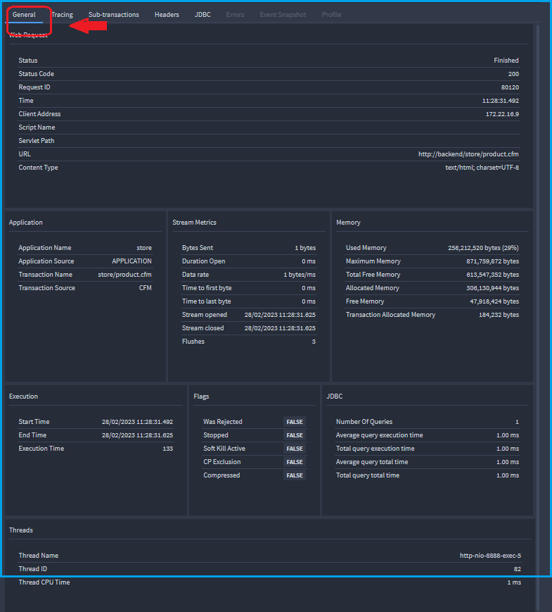

# Servers

🔎**Find it**: **FusionReactor** > **Servers**

 The **Server** view presents an overview of the servers running a FusionReactor agent inside your infrastructure. From inside this view you can choose an overview of your servers or [more detailed information](/frdocs/Data-insights/Features/servers/#detailed-server-overview) about a subset of them. The **Servers** page is the only part of cloud with live mode.

!!! info 
    There is no offline filter on the servers home page. To debug offline servers go to [Explore](/frdocs/Data-insights/Features/explore/). 
    

## Live mode, immediate and historic data

* The Servers screen defaults to **Live mode** indicated by the orange clock.

* Live mode refers to data that is live streamed from an instance and is streamed in real-time. It is useful for viewing and resolving immediate issues. 

* Immediate is data requested from instance in realtime.

* Historic data is stored traces which are powered by the [time picker](/Cloud/guides/timepicker/) To view historic data, simply toggle the **Live mode** clock. 

* Historic data can be filtered according to the default times, for example **last hour** or you can customize your time frame according to your needs.

|  Feature |  Default state |  Live mode  | Immediate | Historic |
|---|---|---|---|---|
|Metrics   | Live  |  &check;  |  &cross;| &check;  |
| Web Requests    Stored traces| Live  |   &check;   &cross; |  &check;   &cross;    | &cross;   &check; |
| Transactions    Stored traces | Live  | &check;   &cross;   |  &check;   &cross;   | &cross;   &check; |
| JDBC    Stored traces|  Live  |&check;    &cross;  |  &check;   &cross;   |  &cross;   &check;|
| Thread state   CPU Sampler   Thread visualizer |  Immediate   Live   Live|  &cross;   &check;   &check;  | &check;   &cross;   &cross; | &cross;   &check;   &check; |
|  Profiles | Immediate  | &cross;| &check;  |&cross;|
| Stack trace  | Immediate | &cross;| &check;  |&cross;|
| Logs  |   Live  |  &check;   | &check;   |  &cross; |
|  Applications | Immediate | &cross;| &check;  |&cross;|
|  Info | Immediate  | &cross;| &check;  |&cross;|

!!! info "Learn more"
    [Time picker](/Cloud/guides/timepicker/)

!!! tip
    Pinching an individual **metrics** graph will enable deeper insight in **historic mode only**.  
    

## Filtering

The filter bar allows you to:
 
* Search for groups by name in the **Groups** search bar (far left of screen).
* Search for a server by name in the **Servers** search bar (left of screen).
* Filter by FusionReactor agent version, in the **Agent** dropdown.
* Show or hide labels, in the **Labels** dropdown

!!! note
    Only on the [overview](/frdocs/Data-insights/Features/servers/#detailed-server-overview) screen.

* Choose to sort the entire page, in the **Sort by** dropdown by:
    * Name
    * Online time
    * Offline time
* Choose to sort the entire page,in the **Sort order** dropdown by:
    * Ascending
    * Descending

* Use the icon on the far right of the screen to clear all filters.

## Detailed server overview

Each FusionReactor instance is represented as a server panel, which displays metric data based on the selected time frame, alongside some basic information for that instance.

Clicking on an individual server panel displays the following screen:

### Metrics

🔎**Find it**: **FusionReactor** > **Servers** > **Metrics** (default)

The default view is the **Web Server** profile and on this screen you can filter by **Profile**, **Graphs**, **Hide empty** and **View**.

* In the **Profile** dropdown, sort the entire page by **System** profiles or **Custom**.
   
* In the **Graphs** dropdown, add required graphs such as, **Buffer pool - mapped**. The default graphs displayed are:

| Default graphs  |   |   |   
|---|---|---|
|  CPU (%)  | JDBC activity (Requests / sec)  | JDBC time (ms)  |   
|  Memory (MB) | Request activity (Request / sec)  | Request time (ms)  |   

* In the **Hide empty** dropdown, you can choose remove graphs without data by selecting **True** or display all by selecting **False**.

* In the **View** dropdown, you can choose to display graphs in a **Grid** or **Row**.

### Web Requests
🔎**Find it**: **FusionReactor** > **Servers** > **Web Requests**

**Web Requests** gives you the ability to view and administer running requests on your server.

On the Web Requests view, you can see if the transaction is running, if it's finished and the time that it finished. You can also view the application that generated the transaction,  the URL of the transaction and finally, the total amount of time in milliseconds the transaction took to complete.

### Transactions

🔎**Find it**: **FusionReactor** > **Servers** > **Transactions**

**Transactions** displays all transactions that are currently running on your server. 

On the transactions view, you can see if the transaction is running, if it's finished and the time that it finished. You can also view the application that generated the transaction,  the URL of the transaction and finally, the total amount of time in milliseconds the transaction took to complete.

### JDBC

🔎**Find it**: **FusionReactor** > **Servers** > **JDBC**

The **JDBC** tab gives you the ability to view and administer running JDBC transactions on your server.This information is controlled by the storage strategy and other settings found on the [JDBC Settings](/JDBC/Settings/) page.

On the JDBC view, you can see if the transaction is running, if it's finished and the time that it finished. You can also view the application that generated the transaction,  the URL of the transaction and finally, the total amount of time in milliseconds the transaction took to complete.

#### Transaction details

🔎**Find it**: **FusionReactor** > **Servers** > **Transactions** > **View details**

Selecting the **view details** icon pictured above, displays the **request details** screen below containing detailed information about that transaction.

#### Tab selection
At the top of the **request details** screen there is a copy of the request line from the page you came from. Underneath that there are at least 5 tabs, plus 1 for each context on that transaction. The available tabs are as follows:

| Category           | Types                                                                 |
|--------------------|----------------------------------------------------------------------|
| **General**        | All types                                                            |
| **Tracing**        | Web Request, JDBC Request                                            |
| **Sub-transactions**| Web Request                                                         |
| **Headers**        | Web Request, HTTPClient                                              |
| **JDBC**           | Web Request, JDBC                                                   |

##### General

The **General** tab shows broad information about a request such as **Stream metrics**, **Execution** time, **Memory** levels and **Flags**.

##### Sub-transactions

The **Sub-transactions** tab shows any child transactions or internal transactions that are initiated as a result of the execution of a main transaction.

##### Headers

The **Headers** tab shows the HTTP headers for the request and response objects.

!!! info "Learn more"
    [Request details](/Requests/Request-Details/)

#### Transaction filtering  

All transactions can be filtered by:

| Type |Description  | Status |    
|---|---|---|
|  History | List of the most-recently completed requests.   |Live |
|Activity |Transactions running when the page was loaded or last refreshed.   |Live |
| Error History|  Transactions flagged by FusionReactor as being in error. |Live |
|Event Snapshot History | Tracks the last (n) transactions which had an Event Snapshot generated and attached to the transaction.    |Live |
|Longest Transactions | All transactions in a sequential order that have taken the highest amount of time to complete on this instance.  |Live |
| Slow transactions| Transactions that have a run time that is longer than the threshold limit (8 seconds by default).  |Live |
| By Memory| All transactions in a sequential order that have used the highest amount of memory on this instance.  | Live|
| Stored Traces| Everything saved to a transaction including sampled and interesting transactions.  | Historic |

!!! info 
    Transactions stored in FR Cloud from offline instances can be found in the [Explore](/frdocs/Data-insights/Features/explore/) section under Traces.   

### Threads

🔎**Find it**: **FusionReactor** > **Servers** > **Threads**

This feature retrieves and collects all live system thread data and their respective metadata. This includes: thread IDs, thread names, thread groups, thread states and critical CPU timing.

Sample information is given at the top left, this data relates to the current sample being processed:

Name|Description|
|--- |--- |
|**JVM start time** |The time the Java Virtual Machine was initialized.|
| **Sample time**| The time interval at which data was collected or measured.|
| **Thread count**| The number of threads the sampler is currently watching.|
| **Total CPU time (ms)**| The collective amount, to millisecond precision, of each thread's CPU time.|

#### Threads filtering

🔎**Find it**: **FusionReactor** > **Servers** > **Threads** > **Thread state**

Threads can be filtered by:

* Any (default)

* RUNNING

* RUNNABLE

* DEADLOCKED

* WAITING

* TIMED_WAITING

* BLOCKED

#### CPU SAMPLER

🔎**Find it**: **FusionReactor** > **Servers** > **Threads** > **CPU sampler**

The **CPU sampler** retrieves all active threads and their CPU information since the Java Virtual Machine started. Alongside this, it also render the live state the thread is in. This data will be updated at every page refresh.

The **Delta** feature in the CPU Sampler is an incredibly useful feature. Once delta values are tracked, they provide the user with the current CPU usage since the button was clicked till the current time. 

The **Reset** button (to the right of Delta) allows you to set a new time (baseline) from where the thread CPU time is calculated.

To assess the performance of certain CPU-heavy threads the user can sort the table by highest **Thread CPU time** (%). The more expensive threads will then be filtered to the top. The Thread CPU Time % is the percentage of that particular thread's CPU usage against the total CPU time of all running threads. From there, users can take further action to speed up their server using pre-existing FusionReactor tools, such as:

* Get a stack trace of the thread.

* Kill the thread.

* Profile the thread.

* Pause the thread.

##### NEW CPU snapshot

Snapshots provide CPU Sampler information at the exact moment of capture. Multiple CPU Snapshots can be taken and stored in FusionReactor.

Snapshots can be taken at any moment during the execution of a sample, this is achieved by the **New CPU snapshot** button.

!!! info "Learn more"
    [CPU snapshots](/Profiler/CPU-Sampler/#cpu-snapshots)

#### Thread visualizer

🔎**Find it**: **FusionReactor** > **Servers** > **Threads** > **Thread visualizer**

The **Thread Visualizer** page shows all threads within the Java Virtual Machine (JVM) for this server. Each color represents the state the thread was in when the data was updated. 

The **Thread Visualizer** page is session based. As soon as the browser tab is closed or refreshed the data will be lost and the graph will restart.

#### Searching

The search bar allows the user to filter the threads shown based on if
the thread name contains the characters in the search. For example, if the user inputted "http" into the search bar, any thread names containing **http** will be shown along with their table elements.

Threads can also be filtered using the dropdown by:

* Any (default)

* RUNNING

* RUNNABLE

* DEADLOCKED

* WAITING

* TIMED_WAITING

* BLOCKED
!!! info
    Clearing the search bar will remove the filter and all threads will be displayed. 

#### Sorting

Threads in the **Thread visualizer** page are sorted by five categories both ascending and descending:

Name|Description|
|--- |--- |
|**Thread name**|The name of the thread given as a string.|
|**User time (ms)**|The user-level CPU time for the specified thread.|
|**CPU time (ms)**|The total CPU time for a specified thread.|
|**Wait time (ms)**|Total time a thread has been waiting (including timed) for another thread to perform a particular action.|
|**Blocked time (ms)**|Total time a thread is blocked waiting for a monitor lock.|

!!! info "Learn more"
    [Thread visualizer](/Resources/Thread-Visualizer/#thread-visualizer)

### Profiles

🔎**Find it**: **FusionReactor** > **Servers** > **Profiles**

This section  provides more information about the Code Profiler details of a transaction or thread.  The Profiler is used to discover what part of an application (method) consumes the most amount of CPU and time. Essentially the Code Profiler can be used to isolate performance bottlenecks in your code.

In the screenshot above, you can see if the transaction or thread is running, if it's finished and the time that it finished. You can also view the status code/IP, the application that generated the transaction, the ID/thread, the URL of the transaction or thread and finally, the total amount of time in milliseconds the transaction or thread took to complete.

<iframe src="https://player.vimeo.com/video/838654258?h=ac365ce240" width="640" height="363" frameborder="0" allow="autoplay; fullscreen" allowfullscreen></iframe>

#### Transaction details

Clicking the icon below **Actions** on the right of the screen, displays the following screen:

You have the ability to:

1.  Decompile a class (Blue color line).
2.  Decompile a method (Red color line).
3.  Add a
    breakpoint into a method (Green color line).
4.  See the individual times of each call in the Profiler
    window. This is represented as something similar to the following:
    **3.0% Self Time**.

!!! note
    You cannot access, decompile or debug any **native methods.**

!!! info "Learn more"
    [Profile examples](/Profiler/Profiler/#examples)

### Stack trace

🔎**Find it**: **FusionReactor** > **Servers** > **Stack trace**

Stack traces provide information on the threads at a specific point in time. 

#### Stack trace filtering

🔎**Find it**: **FusionReactor** > **Servers** > **Threads** > **Thread state**

Stack traces can be filtered by state:

* Any (default)

* RUNNING

* RUNNABLE

* DEADLOCKED

* WAITING

* TIMED_WAITING

* BLOCKED

Stack traces can also be filtered by view:

* All Threads

* Saved Traces

!!! info "Learn more"
    [Stack trace](/Transactions/Stack-Tracing/#stack-trace)

### Logs

🔎**Find it**: **FusionReactor** > **Servers** > **Logs**

The **Logs** tab allows you to view all records of events and activities that occur within a system, application, or infrastructure that are generated by your servers. They contain information about various aspects, such as user actions, errors, warnings, security events, and system performance. Logs are not stored and give live information about an instance.

### Applications

🔎**Find it**: **FusionReactor** > **Servers** > **Applications**

The **Applications** tab provides an overview of the applications running on your instance.

### Info

🔎**Find it**: **FusionReactor** > **Servers** > **Info**

The **Info** page of FusionReactor provides information on  **Agent details**, **Server type**, **Operating system details**, **Java details** and the **Environment** FusionReactor is running within.

!!! note 
    When contacting support it is helpful to copy this page to your clipboard and attach a copy to your request to give our support engineers information on your configured environment.

!!! info "Learn more"
    [Server info](/System-Resources/Server-Info/#overview)

---

!!! question "Need more help?"
    Contact support in the chat bubble and let us know how we can assist.
