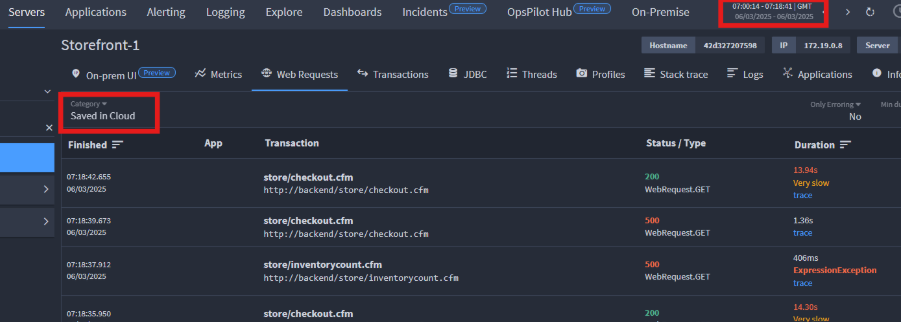

# How to find the cause of CPU spikes

## Finding the cause of CPU spikes

!!! question
    When we get AWS CloudWatch alerts about high CPU usage on a server (shard/cluster), what is the best way to find the root cause in FusionReactor?

1. **Check if the issue is still ongoing or has resolved back to normal state.**  
    - If it was an alert from an earlier time (e.g., overnight), note the time and go to this timeframe within the Cloud UI (use the time selector in the top bar).

2. **Check the Metrics screen:**  
    - Look at the amount of transactions running at that time.
    - Review their completion time and CPU usage to identify when the spike started.

3. **View previous time frames:**  
    - When looking at the Web Requests, Transactions, or JDBC screens, go to **‘Saved in Cloud’** to view historical data.

    

4. **Investigate requests during the spike:**  
    - Identify requests with increased completion time and investigate the cause.
    - Open longer/erroring requests to check traces/sub-transactions and determine where extra time was spent.

5. **Check transaction types:**  
    - Determine if many larger scheduled tasks were executing simultaneously.

6. **Analyze the Applications screen:**  
    - Ensure you are looking at the correct timeframe.
    - Check performance graphs for anomalies or unexpected increases in throughput.

7. **Review Logging for the timeframe in question:**  
    - Look for unusual behavior.
    - Check the IP sending requests to detect if a bot is making multiple requests.

8. **Explore Traces for affected Services:**  
    - Run a query for the specific timeframe.
    - Focus on services with the longest durations to identify the root cause.

