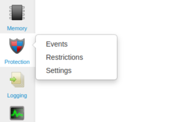
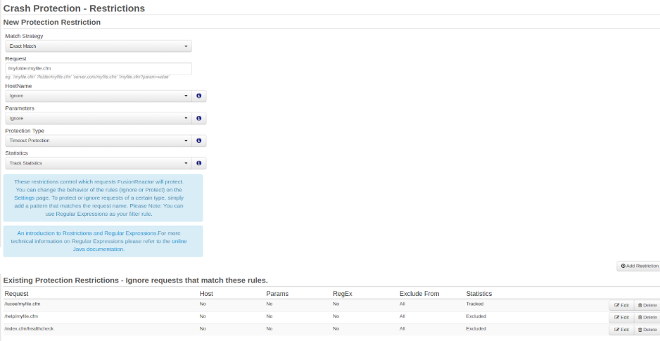

# How to ignore specific requests in FusionReactor

Protection restrictions let you choose which pages the FusionReactor’s Protection system will monitor or ignore. If you have specific requests that you are not interested in monitoring, or if you have requests you are using FusionReactor to exclusively monitor, you can set this mode in the [Protection Settings](/frdocs/Data-insights/Features/Crash-protection/Settings/)

To access Crash Protection in the on-premise UI, navigate to the **Protection** icon then click **Restrictions**.

 
The **Restrictions page** has two sections:  

1. **Add New Restrictions** – Enter new rules in the **New Protection Restriction** section of the form. 
2. **View Existing Restrictions** – Below the form, see a list of current restrictions in the **Existing Protection Restrictions** section.

!!! info "Learn more"
    For more information on creating and managing Crash Protection restrictions, see the [Crash Protection Restrictions](/frdocs/Data-insights/Features/Crash-protection/Crash-Protection/#restrictions) page.
