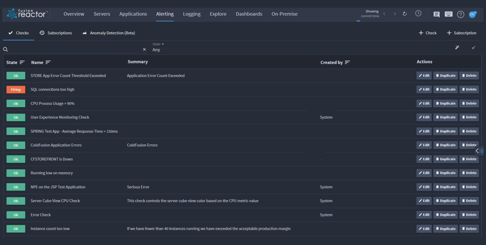
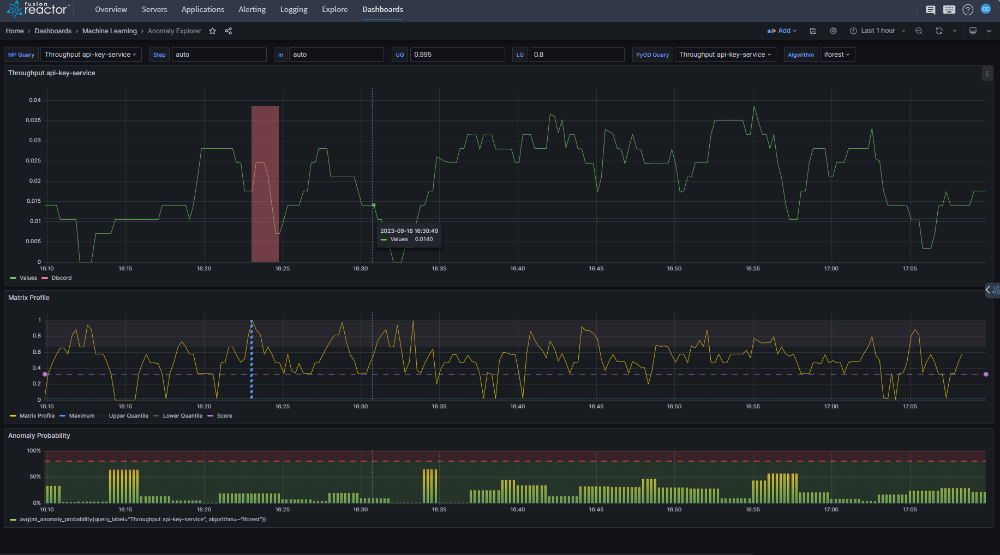
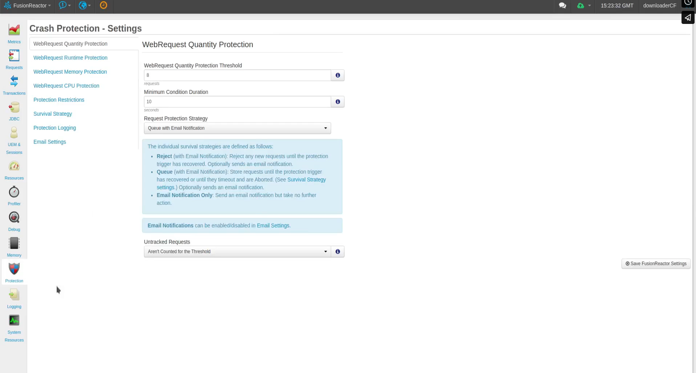
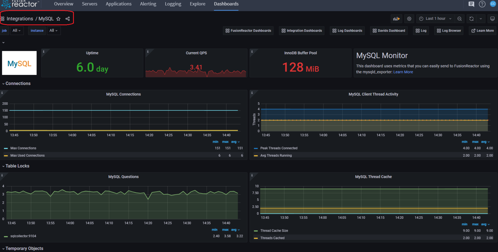
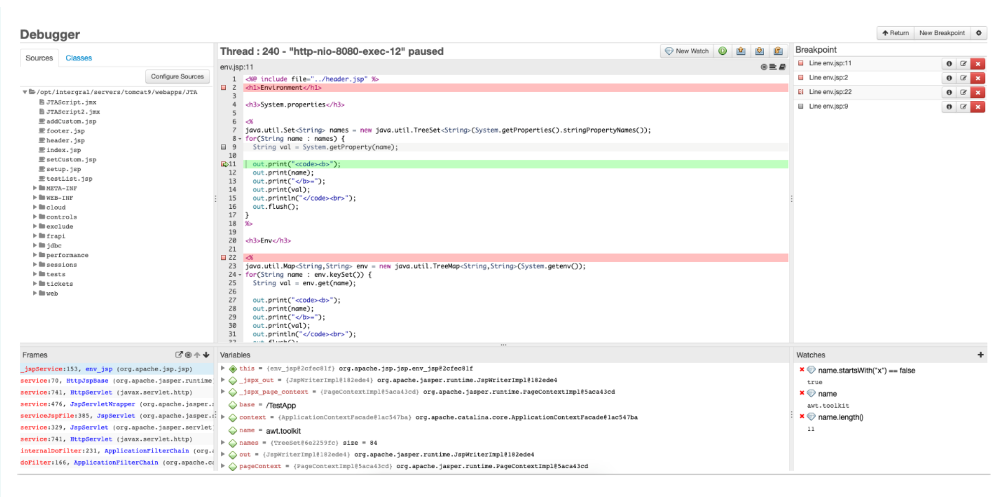
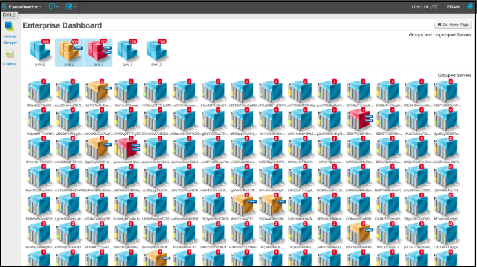
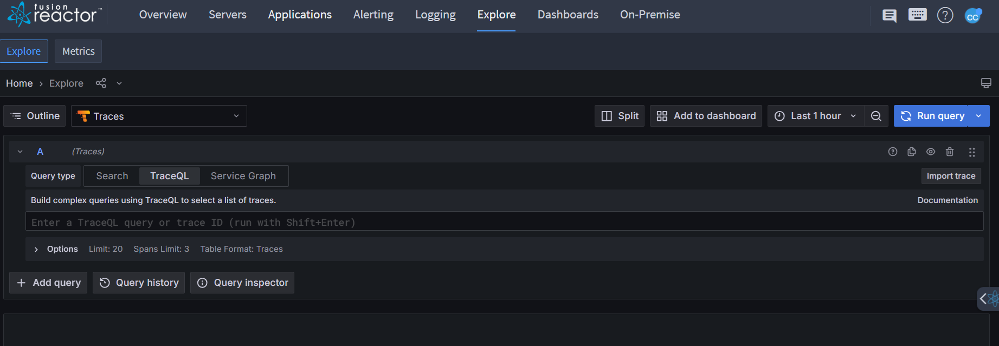
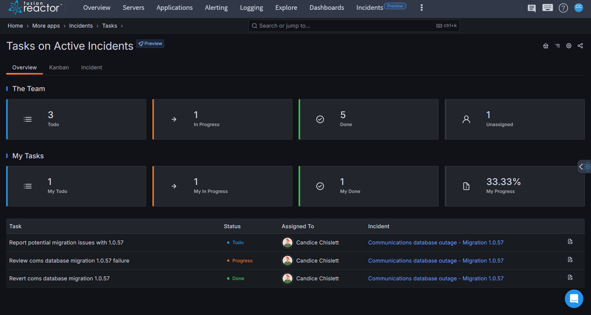
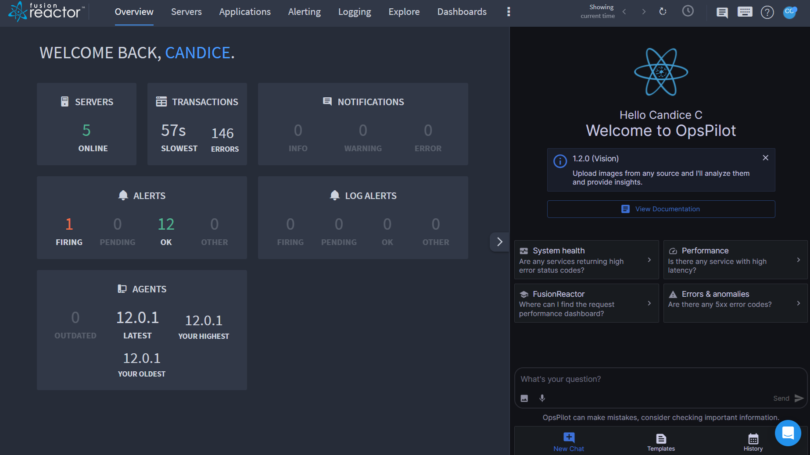
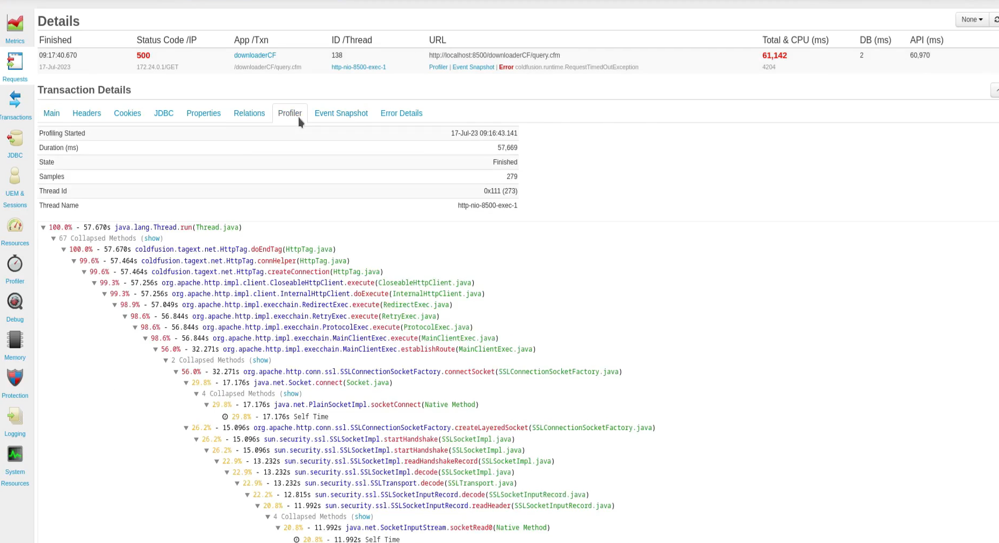

# Get started with FusionReactor 

Welcome to the FusionReactor APM platform! Our CFML monitoring tool provides deep visibility into your systems, helping you solve issues you may not have been aware of, regardless of the technology you use. FusionReactor offers numerous ways to enhance visibility, allowing you to monitor, troubleshoot, and improve digital performance. 
 
Here's a brief overview of our most popular capabilities and features.

## Alerting 

{ align=left width="350" height="250" } FusionReactor Alerting allows  you to create automated checks on the values of metric data gathered by a FusionReactor agent, and generate  alerts when user-made conditions are  met.    Learn more about Alerting **[here](/frdocs/Data-insights/Features/alerting/)**.

 

## Anomaly Detection

{ align=right width="350" height="250" } Anomaly detection is an algorithmic capability designed to recognize instances when a metric displays behavior that diverges from its historical patterns.     Learn more about Anomaly Detection **[here](/frdocs/Data-insights/Features/Anomaly-Detection/ADoverview/)**.

## Crash Protection

{ align=left width="350" height="250" } Crash Protection gives you the ability to alert when the application server is experiencing issues and prevent application servers from crashing.   Learn more about Crash Protection **[here](/frdocs/Data-insights/Features/Crash-protection/Crash-Protection/)**.

 

## Dashboards 

{ align=right width="350" height="250"} Dashboards allow you to visualize your Cloud data with superior, unparalleled depth. You can combine metrics, logs and traces in one place to give you a complete picture of your data.  Learn more about Dashboards **[here](/frdocs/Data-insights/Features/dashboards/)**.

 

## Debugger

{ align=left width="350" height="250"} FusionReactor Production Debugger is a new set of functionality available in the FusionReactor Ultimate Edition from version 6.0. and it provides the ideal solution for developers to gain insight into how code executes at production runtime   Learn more about the Debugger **[here](/frdocs/Data-insights/Features/Debugger/Overview/)**.

## Enterprize Dashboard

{ align=right width="350" height="250"} The Enterprise Dashboard lets you track the state of installations on one or more servers from a single window. Immediately see the state of memory, CPU, DB load and average request time, in a clear, visual dashboard   Learn more about the Enterprize Dashboard **[here](/frdocs/Data-insights/Features/Enterprise-Dashboard/Enterprise-Dashboard/)**. 

## Explore
{ align=left width="350" height="250"} Explore allows you to query and analyse all metrics, logs and traces ingested to your cloud account. Create new data views and filter data in any way you require.   Learn more about Explore **[here](/frdocs/Data-insights/Features/explore/)**. 

## Incidents
{ align=right width="350" height="250"} The Incident Management Application is a robust tool for tracking and resolving incidents in real-time. It streamlines incident workflows, enabling teams to manage tasks, update statuses, and maintain detailed activity logs with ease.   Learn more about Incidents **[here](/frdocs/Data-insights/Features/Incidents/)**. 

## OpsPilot 
{ align=left width="350" height="250"} OpsPilot is designed to elevate observability for every team member, transcending the boundaries of engineering to construct a comprehensive context around your systems.   Learn more about OpsPilot **[here](/frdocs/Data-insights/Features/OpsPilot/AIoverview/)**. 

 
## Profiler

{ align=right width="350" height="250"} The Profiler is designed to help you identify performance bottlenecks in your production environment with **very** low overhead, so you gain maximum benefit, without impacting your running applications. Learn more about the Profiler **[here](/frdocs/Data-insights/Features/Profiler/Profiler/)**. 

 

