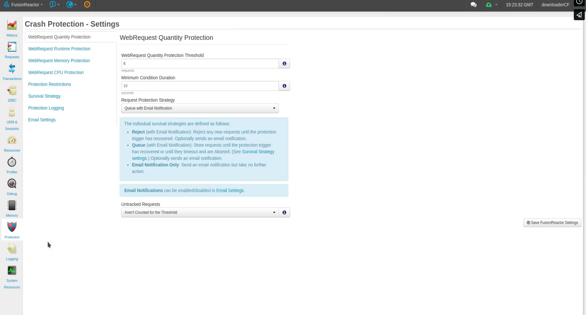
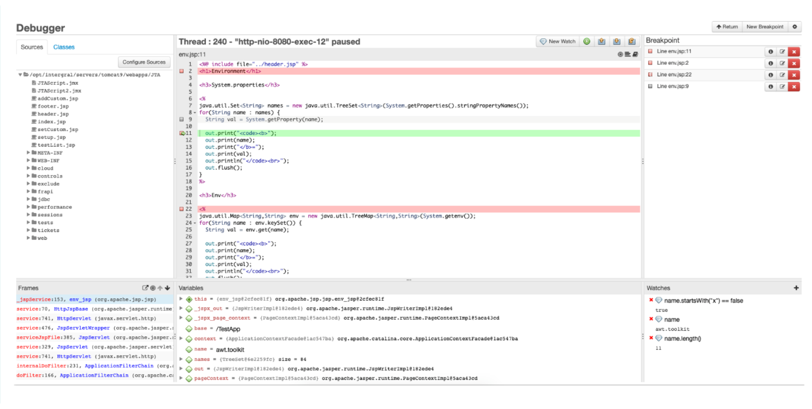
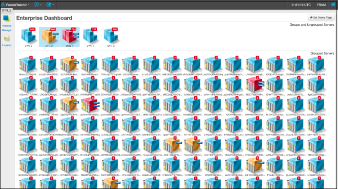
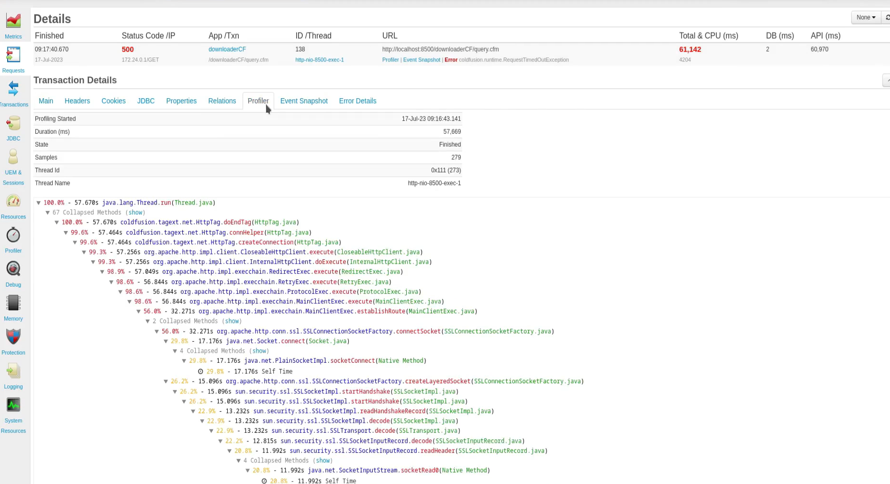

# Get started with FusionReactor 

Welcome to the FusionReactor APM platform! Our CFML monitoring tool provides deep visibility into your systems, helping you solve issues you may not have been aware of, regardless of the technology you use. FusionReactor offers numerous ways to enhance visibility, allowing you to monitor, troubleshoot, and improve digital performance. 
 
Here's a brief overview of our most popular capabilities and features.

## Crash Protection

{ align=left width="350" height="250" } Crash Protection gives you the ability to alert when the application server is experiencing issues and prevent application servers from crashing.   Learn more about Crash Protection **[here](/Data-insights/Features/Crash-protection/Crash-Protection/)**.

 

## Debugger

{ align=right width="350" height="250"} FusionReactor Production Debugger is a new set of functionality available in the FusionReactor Ultimate Edition from version 6.0. and it provides the ideal solution for developers to gain insight into how code executes at production runtime   Learn more about the Debugger **[here](/Data-insights/Features/Debugger/Overview/)**.

## Enterprize Dashboard

{ align=left width="350" height="250"} The Enterprise Dashboard lets you track the state of installations on one or more servers from a single window. Immediately see the state of memory, CPU, DB load and average request time, in a clear, visual dashboard   Learn more about the Enterprize Dashboard **[here](/Data-insights/Features/Enterprise-Dashboard/Enterprise-Dashboard/)**. 

## Profiler

{ align=right width="350" height="250"} The Profiler is designed to help you identify performance bottlenecks in your production environment with **very** low overhead, so you gain maximum benefit, without impacting your running applications. Learn more about the Profiler **[here](/Data-insights/Features/Profiler/Profiler/)**. 

 

!!! tip "Want cloud observability?"
    Looking for alerting, anomaly detection, dashboards, incidents, and AI-powered insights? **OpsPilot** is our cloud-native OTel platform that extends FusionReactor with full-stack observability.
    [Learn more about OpsPilot](https://app.opspilot.com).
