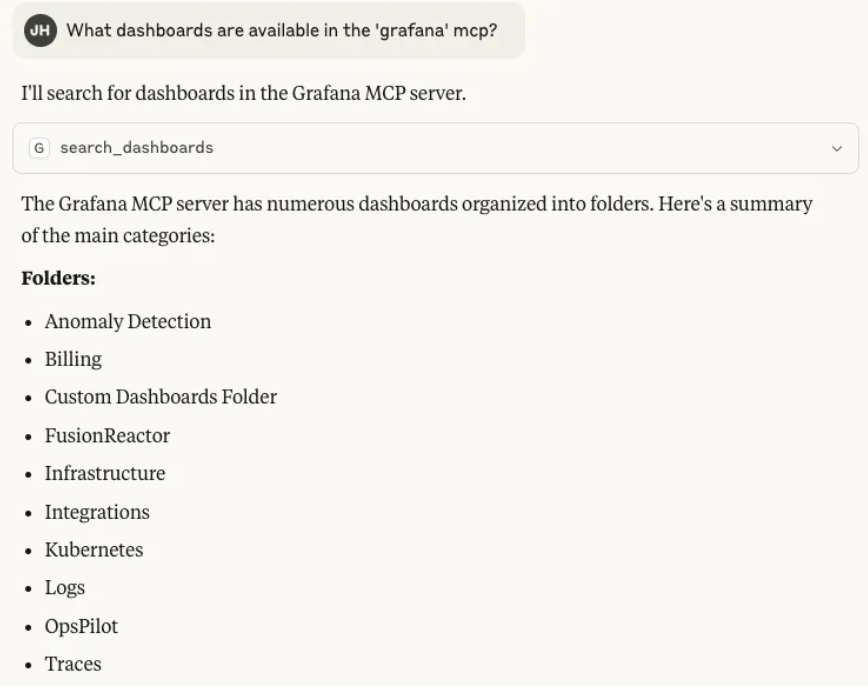

# Installing the FusionReactor Cloud MCP

To connect your AI tooling to FusionReactor Cloud using MCP, follow the steps below.

---

## Step 1: Generate a FusionReactor API Key

You’ll need an API key so your tooling can authenticate with the FusionReactor MCP.

!!! info
    [Generate an FR API key](https://docs.fusionreactor.io/Admin-and-data/Account/Cloud/users/?h=api+key#api-keys)

---

## Step 2: Install and configure the MCP Adapter

FusionReactor Cloud MCP is based on the [Grafana MCP adapter](https://github.com/grafana/mcp-grafana).

Here’s an example configuration for connecting [Claude Desktop](https://claude.ai/download) to FusionReactor Cloud using the MCP adapter.

The simplest way to get started is by using the prebuilt Grafana MCP Docker image, together with SSE (Server-Side Event) streams. Grafana provides [additional documentation](https://github.com/grafana/mcp-grafana?tab=readme-ov-file#usage) for alternative methods.

---

### Prerequisites

1. **Node/NPM** must be installed, particularly the `npx` command.  
     - **Test**: Run `npx mcp-remote` in a shell. You should see a `Usage:` message.
2. **Docker** must be installed and functioning.  
    - **Test**: Run `docker ps` in a shell to confirm it's working.
3. **Claude Desktop, Claude Code, or another MCP host** must be installed.  
    - This example uses Claude Desktop.
4. **A FusionReactor Cloud API Key** is required.  
    - [Generate an FR API key](https://docs.fusionreactor.io/Admin-and-data/Account/Cloud/users/?h=api+key#api-keys)

---

### Procedure

1. **Start the Docker container:**

    `docker run --rm -d -p 8000:8000 -e GRAFANA_URL=https://api.fusionreactor.io/g -e GRAFANA_API_KEY=<FR API KEY> mcp/grafana`


    * The docker will run and detach.  
    * If you need to kill it later, use `docker ps` to find its name or container ID, then use `docker kill <id>` to stop it.


2. **Configure Claude Desktop:**

    * Go to: Claude → Settings → Developer → Edit Config
    * Add the MCP definition (example provided in next section)

    ````JSON
    {
      "mcpServers": {
        "grafana": {
          "command": "npx",
          "args": [
            "mcp-remote",
            "http://localhost:8000/sse"
          ]
        }
      }
    }
    ````


1. **Restart Claude Desktop.**   

2. **You should then be able to use this MCP in conversation with the AI:**


    { width=75% }

---

## Additional notes

- This MCP interface is **read-only** – it allows querying data, not modifying it.
- See the [features section](https://github.com/grafana/mcp-grafana?tab=readme-ov-file#features) of Grafana MCP for a full list of supported functionality.

